<h1 id="Contents">

Preliminary Draft of TrustNote Cryptographic Algorithms</h1>

-----------

<h1 id="Contents">Contents</h1>

<ul class="toc_list">
<li><a href="#Disclaimer">Disclaimer</a></li>
<li><a href="#Howwe">How do we select the best among nomeniees?</a></li>
<ul><li><a href="#WhyB2">Why Blake2?</a></li></ul>
<ul><li><a href="#whyed">Why Ed25519?</a></li></ul>
<ul><li><a href="#eqhwhy">Why Equihash?</a></li></ul>
<li><a href="#MATH">Introduction & Mathematical foundation</a></li>
 <ul><li><a href="#mathb2">Blake2</a></li></ul>
 <ul>
 <ul><li><a href="#mathb2b">Blake2b</a></li></ul>
  <ul><li><a href="#mathb2s">Blake2s</a></li></ul>
 </ul>
<ul><li><a href="#EdIntro">Ed25519</a></li></ul>
<ul>
<li><a href="#eqhmath">Equihash</a></li>
</ul>
<li><a href="#HTGSG">How to get started with it?</a></li>
<ul>
<li><a href="#LGSB2">Let's get started with Blake2-Node.js-Addon</a></li>
<ul>
<li><a href="#LGSB2PJ">Blake2 Pure JavaScript-Node-Addon</a></li>
<li><a href="#LGSB2CA">Blake2 C/C++ Node-Addon</a></li>
</ul>
<li><a href="#LGSEd">Let's get started with Ed25519-Node-Addon</a></li>
<li><a href="#LGSEqh">Let's get started with Equihash</a></li>
</ul>
<li><a href="#Diss">Discussion</a></li>
<li><a href="#ref">References</a></li>
<li><a href="#APPX">Appendices</a></li>
<ul>
<li><a href="#APPX1">Appendix1: Blake2b-PureJava-test</a></li>
<li><a href="#APPX2">Appendix2: Blake2s-PureJava-test</a></li>
<li><a href="#APPX3">Appendix3: Blake2b-C/C++ Node.js-Addon-test</a></li>
<li><a href="#APPX4">Appendix4: Blake2s-C/C++ Node.js-Addon-test</a></li>
<li><a href="#APPX5">Appendix5: Ed25519-C/C++ Node.js-Addon-test</a></li>
</ul>
</ul>

----------

<h1 id="Disclaimer">Disclaimer</h1>

TrustNote Intitute of Technology and Reseach & Development section hereby declear that, this package is under MIT opensource software license and this software is distributed without any warranty. TrustNote Institue of Technology declears that we are <b>NOT</b> responsible for direct, indirect, incidental or consequential damages resulting from any defect, error or failure to perform. This package is <b>experimental and a work-in-progress</b>, use at your own risk. TrustNote R&D team can update (add/remove packages) any time without informing the users.

----------

<h1 id="Howwe">How do we select the best among the nomeniees?</h1>

Selecting an efficient algorithm which also would be robust and secure while it can be performed very fast for many times per second on variety of devices is a very important and difficult process. Any failure or security hole will result in an irreparable damage. <b>TrustNote Institute of Technology - R&D section</b> criteria for selecting its project's cryptographic algorithms are:

- <b>High security level and Robustness</b>
- <b>Better performance</b>
- <b>Most compatible one with varaity of devices</b>

So, any algorithm fits the best into these three criteria will be selected by us. But it's not the end, after selecting the best available algorithm, our experts in TrustNote will perform several challenging tests to verify its trustworthy.

----------

<h2 id="WhyB2">Why Blake2?</h2>

Selecting an efficient, secure and fast hash function is crucial during the design process of any cryptocurrency infrastructure. A proper hash function algorithm has enough robustness so in case of encountering Collision attack, Preimage attack and etc. It should be undefeatable. We have a list of available hash function algorithm which is presented in the table below:

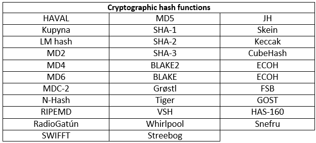

**Please, note that: The orders in table above are totally by randomness and this table is not sorted by any kind of factors.**

You can see a full list of available Hash functions and their eBASH (ECRYPT Benchmarking of All Submitted Hashes) benchmarks avialable at:

- eBASH benchmarks for [Blake2b](http://bench.cr.yp.to/impl-hash/blake2b.html).
- eBASH benchmarks for [Blake2s](http://bench.cr.yp.to/impl-hash/blake2s.html).
- eBASH benchmarks for [results of benchmarking of all hash functions](http://bench.cr.yp.to/results-hash.html).
- eBASH benchmarks for [full list of hash functions](http://bench.cr.yp.to/primitives-hash.html)

However, this is not our main reason for choosing blake2. In the rest of this section, we will introduce our reasons why we picked blake2 among plenty of available hash fuctions.

BLAKE2 is a cryptographic hash function faster than MD5, SHA-1, SHA-2, and SHA-3, yet is at least as secure as the latest standard SHA-3. BLAKE2 has been adopted by many projects due to its high speed, security, and simplicity. BLAKE2 comes in two types [3]:
- **BLAKE2b** (or just BLAKE2) is optimized for 64-bit platforms including NEON-enabled ARMs and produces digests of any size between 1 and 64 bytes [3].
- **BLAKE2s** is optimized for 8- to 32-bit platforms and produces digests of any size between 1 and 32 bytes [3].

BLAKE2 includes the 4-way parallel BLAKE2bp and 8-way parallel BLAKE2sp designed for increased performance on multicore or SIMD (Single Instruction, Multiple Data) CPUs. BLAKE2 offers these algorithms tuned to your specific requirements, such as keyed hashing (that is, MAC or PRF), hashing with a salt, updatable or incremental tree-hashing, or any combination thereof.

The SHA-3 Competition succeeded in selecting a hash function that complements SHA-2 and is much faster than SHA-2 in hardware [1]. There is nevertheless a demand for fast software hashing for applications such as integrity checking and deduplication in filesystems and etc. [2]

The chart below is the speed comparison of various popular hash functions, taken from eBACS’s “sandy” measurements. SHA-3 and BLAKE2 have no known security issues. SHA-1, MD5, SHA-256, and SHA-512 are susceptible to length-extension. SHA-1 and MD5 are vulnerable to collisions. MD5 is vulnerable to chosen-prefix collisions [2].

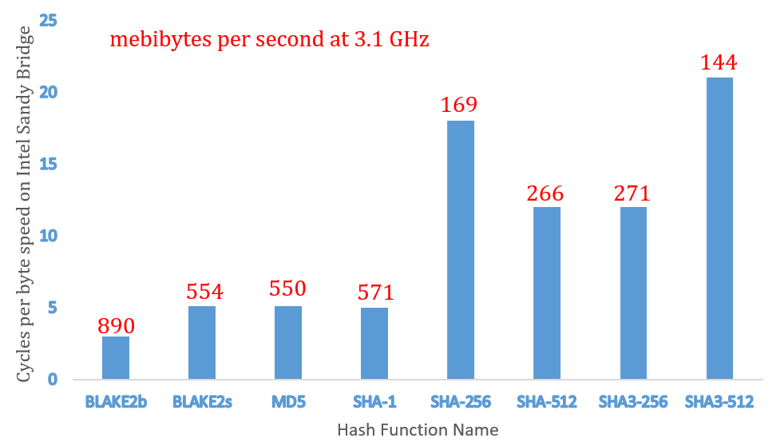

BLAKE thus appears to be a good candidate for fast software hashing. BLAKE2 aims to provide the highest security level, be it in terms of classical notions as (second) preimage or collision resistance, or of theoretical notions as pseudorandomness or indifferentiability [2].

Blake2 offers the following properties and capabilities:

- **Faster than MD5** on 64-bit Intel platforms.
- **32% less RAM** required than BLAKE.
- **Minimal padding**, which is faster and simpler to implement.
- Direct support, with no overhead, of:
  - **Parallelism** for many-times faster hashing on multicore or SIMD (Single Instruction, Multiple Data) CPUs.
  - **Tree hashing** for incremental update or verification of large files.
  - **Prefix-MAC** for authentication that is simpler and faster than HMAC.
  - **Personalization** for defining a unique hash function for each application.

**Consequently**, it is evident that blake2 is the best available hash function untill now. We may change the hash if we find some flaw in Blake2 or if we find another hash function algorithm which offers higher assurance and performance. For more in-depth information about blake2 capabilities, please visit the [Blake2](https://blake2.net/#sp) official website.

----------

<h2 id="whyed">Why Ed25519?</h2>

In previous section we discussed the importance and challanges of selecting a cryptographic hash function. In this section we are going to select a Public-key cryptography algorithm. There are plenty of theories that these algorithms are developed and created based on them, to name some we can say: Discrete logarithm, Elliptic-curve cryptography, Non-commutative cryptography, RSA (Rivest–Shamir–Adleman) problem and Trapdoor function. Furthermore, for each mathematical algorithm which we already mentioned them, there are numerious number of Public-key cryptography algorithms which you can see some of them in the table below:

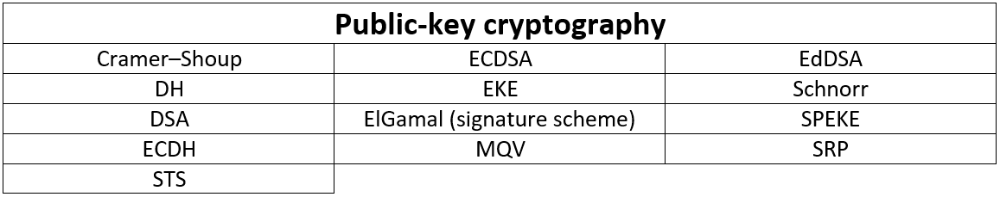

You can see a full list of available Public-key cryptography algorithms and their eBATS (ECRYPT Benchmarking of Asymmetric Systems) benchmarks avialable at:

- eBATS benchmarks for [Ed25519](http://bench.cr.yp.to/impl-sign/ed25519.html).
- eBATS benchmarks for [results of benchmarking of all Public-key signatures](http://bench.cr.yp.to/results-sign.html).
- eBATS benchmarks for [full list of Public-key signatures](http://bench.cr.yp.to/primitives-sign.html)

<html>
However, this is not our main reason for choosing Ed25519. In the rest of this section, we will introduce our reasons why we picked Ed25519 among plenty of available Public-key signatures. Starting with introducing a list of Ed25519 features [7]:
</html>

<ul>
<li><b>Fast single-signature verification</b> Ed25519 takes only 273364 cycles to verify a signature on Intel's widely deployed Nehalem/Westmere lines of CPUs. This performance measurement is for short messages. </li>
<li><b>Even faster batch verification</b> Ed25519 performs a batch of 64 separate signature verifications (verifying 64 signatures of 64 messages under 64 public keys) in only 8.55 million cycles, i.e., under 134000 cycles per signature. It fits easily into L1 cache, so contention between cores is negligible: a quad-core 2.4GHz Westmere verifies 71000 signatures per second, while keeping the maximum verification latency below 4 milliseconds.</li>
<li><b>Very fast signing</b> Ed25519 takes only 87548 cycles to sign a message.</li>
<li><b>Fast key generation</b> Key generation is almost as fast as signing. There is a slight penalty for key generation to obtain a secure random number from the operating system;</li>
<li><b>High security level</b> This system has a 2128 security target; The best attacks known actually cost more than 2140 bit operations on average, and degrade quadratically in success probability as the number of bit operations drops. </li>
<li><b>Foolproof session keys</b> Signatures are generated deterministically; key generation consumes new randomness but new signatures do not. This is not only a speed feature but also a security feature, directly relevant to the recent collapse of the Sony PlayStation 3 security system. </li>
<li><b>Collision resilience</b> Hash-function collisions do not break this system. This adds a layer of defense against the possibility of weakness in the selected hash function.</li>
<li><b>No secret array indices</b> Ed25519 never reads or writes data from secret addresses in RAM; the pattern of addresses is completely predictable. The software is therefore immune to cache-timing attacks, hyperthreading attacks, and other side-channel attacks that rely on leakage of addresses through the CPU cache.</li>
<li><b>No secret branch conditions</b> Ed25519 never performs conditional branches based on secret data; the pattern of jumps is completely predictable. The software is therefore immune to side-channel attacks that rely on leakage of information through the branch-prediction unit.</li>
<li><b>Small signatures</b> Signatures fit into 64 bytes. These signatures are actually compressed versions of longer signatures; the times for compression and decompression are included in the cycle counts reported above.</li>
<li><b>Small keys</b> Public keys consume only 32 bytes. The times for compression and decompression are again included.</li>
</ul>

**Eventually**, it is evident that Ed25519 is one of the best available Public-key signature algorithm untill now which is going to be used for digital signatures. We may change the Public-key signature if we find some flaw in Ed25519 or if we find another Public-key signature algorithm which offers higher assurance and performance. We picked Ed25519 algorithm because of the advantages this algoritm offering. For more in-depth information about Ed25519 features please visit [Ed25519](https://ed25519.cr.yp.to/papers.html) official website.

----------

<h2 id="eqhwhy">Why Equihash?</h2>

There are four main consensus mechanisms, a consensus mechanism is fundamental problem in distributed computing and multi-agent systems is to achieve overall system reliability in the presence of a number of faulty processes. These mechanisms listed as below:

<ul>
<li><b>Proof-of-Authority</b></li>
<li><b>Proof-of-Space</b></li>
<li><b>Proof-of-Stake</b></li>
<li><b>Proof-of-Work system</b></li>
</ul>

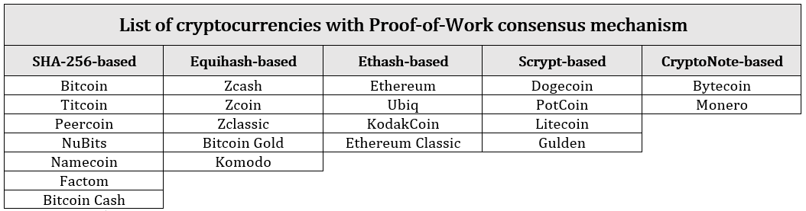

In proof-of-work mining, miners are tasked with generating a short binary blob (called a nonce), which, when hashed, produces an output value less than a pre-specified target threshold. Due to the cryptographic nature of each currency’s hash function, there is no way to reverse-engineer or back-compute a nonce that satisfies the target threshold limit. Instead, miners must “guess-and-check” hashes as fast as possible, and hope they’re the first miner in the entire crypto-currency’s network to find a valid nonce.

There are varaity of algorithms based on this consensus mechanism such as Equihash, Ethash. Equihash is a memory-oriented Proof-of-Work algorithm developed by the University of Luxembourg's Interdisciplinary Centre for Security, Reliability and Trust (SnT). **Zcash, Zcoin, Zclassic, Bitcoin Gold and Komodo** all using equihash while **Ethereum, Ethereum Classic, KodakCoin and Ubiq** are using Ethash. Equihash is a memory-oriented Proof-of-Work, which means how much mining you can do is mostly determined by how much RAM you have. The chart below shows how the ethash works. the main advantage of equihash over ethash is simplicity in algorithm. Equihash having the same speed on both CPU and GPU instead, Ethash has different speeds on CPU, GPU and FPGA based compilation. Finally, we can calculate the chance of reachinhg solution/solutions of equihash by taking advantage of special probablity. The diagram of Ethash Algorithm and Equihash algorithms are presented below from refrence [5]:

**Equihash Algorithm**

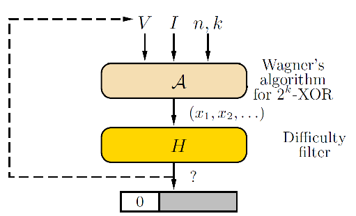

**Finally,** We may change the Proof-of-Work, if we find some defect in Equihash or if we find another Proof-of-Work algorithm which offers higher performance, security and assurance. For more in-depth information about Equihash properties please, see the reference [2].

----------

<h1 id="MATH">Introduction & Mathematical foundation</h1>

<h2 id="mathb2">Blake2</h2>

In this section we will introduce the parameters and mathematical foundation of Blake2 (Blake2b and Blake2s) Adopted from reference [2], for more in depth.

**Parameter Blocks of Blake2b and Blake2s**

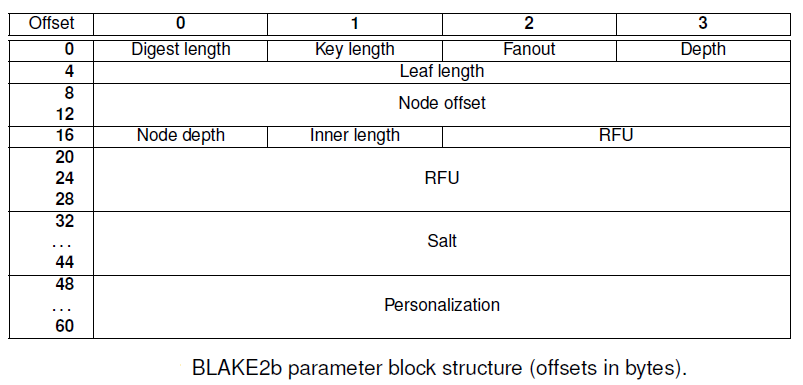
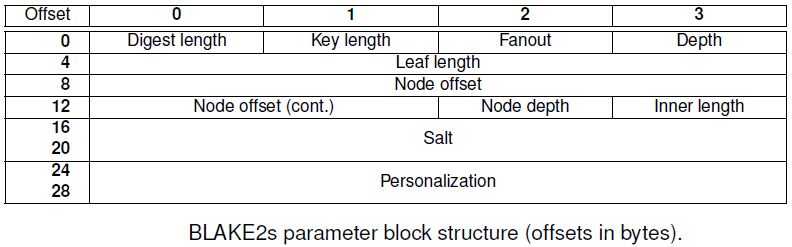

**The Parameters of Blake2b & Blake2s**
- General parameters:
  - **Digest byte length** (1 byte): an integer in [1, 64] for BLAKE2b, in [1, 32] for BLAKE2s
  - **Key byte length** (1 byte): an integer in [0, 64] for BLAKE2b, in [0, 32] for BLAKE2s (set to 0 if no key is used)
  - **Salt** (16 or 8 bytes): an arbitrary string of 16 bytes for BLAKE2b, and 8 bytes for BLAKE2s (set to all-NULL by default)
  - **Personalization** (16 or 8 bytes): an arbitrary string of 16 bytes for BLAKE2b, and 8 bytes for BLAKE2s (set to all-NULL by default)
- Tree hashing parameters:
  - **Fanout** an integer in [0, 255] (set to 0 if unlimited, and to 1 only in sequential mode)
  - **Maximal depth** (1 byte): an integer in [1, 255] (set to 255 if unlimited, and to 1 only in sequential mode)
  - **Leaf maximal byte length** (4 bytes): an integer in [0, 232 - 1], that is, up to 4 GiB (set to 0 if unlimited, or in sequential mode)
  - **Node offset** (8 or 6 bytes): an integer in [0, 264-1] for BLAKE2b, and in [0, 248-1] for BLAKE2s (set to 0 for the first, leftmost, leaf, or in sequential mode)
  - **Node depth** (1 byte): an integer in [0, 255] (set to 0 for the leaves, or in sequential mode)
  - **Inner hash byte length** (1 byte): an integer in [0, 64] for BLAKE2b, and in [0, 32] for BLAKE2s (set to 0 in sequential mode)

<h3 id="mathb2b">Blake2b</h3>

BLAKE2b supports data of any byte length <html><math> 0 <mo>&#x2A7D;</mo> *l* <mo>&#x2A7D;</mo> 2128 </math></html>. Data is first padded to form a sequence of N = *[l/128]* 16-word blocks m0, m1, ... ,mN-1 and then hashed by doing [2]:

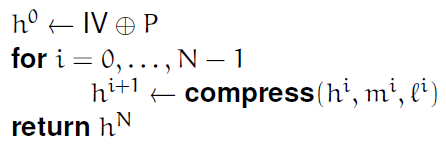

where *l*i denotes the number of data bytes in m0, m1, ... ,mN-1 (that is, not counting any padding byte), P is the parameter block specified in **Parameter Blocks**, and IV is (as in BLAKE and SHA-512) the following 64-bit words [2]:

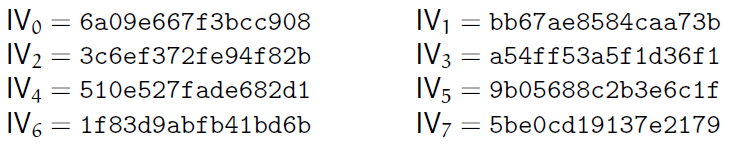

The compression function **compress** takes as input [2]:

- A 64-byte chain value h = h0, ..., h7
- A 128-byte message block m = m0, ..., m15
- A counter t = t0, t1, and finalization flags f0, f1

First, compress initializes a 16-word internal state v0, ..., v15 that is [2]:

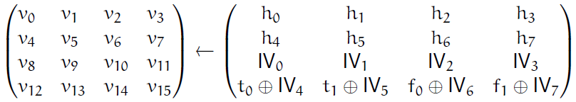

where f0 and f1 are the finalization flags. The internal state *v* is then transformed through a sequence of 12 rounds, where a round does [2]:

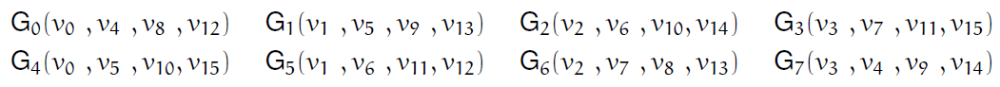

That is, a round applies a G function to each of the columns in parallel, and then to all of the diagonals in parallel. The G function of BLAKE2b uses the constants in the table below which is permutations of *f {0, ..., 15}* used by the BLAKE2 functions [2].

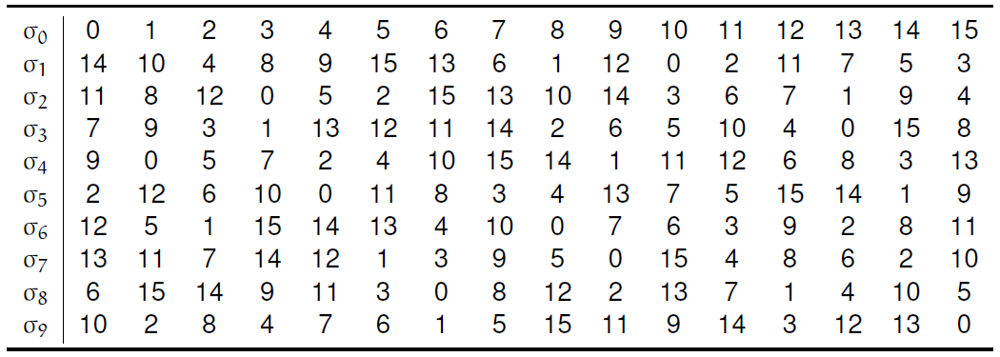

After the 12 rounds, the new chain value h0', ..., h7' is defined as [2]:

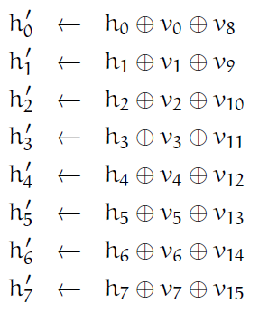

<html>
Note the absence of the salt, compared to BLAKE.
</html>

<h3 id="mathb2s">Blake2s</h3>

BLAKE2s supports data of any byte length <html><math> 0 <mo>&#x2A7D;</mo> *l* <mo>&#x2A7D;</mo> 264 </math></html>. It works similarly to BLAKE2b, but on 32-bit words instead of 64-bit words (the byte length of a chaining value, a message block, a counter or finalization flag are thus divided by two). BLAKE2s uses the following IV:

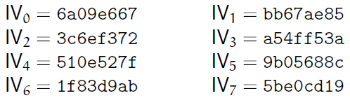

BLAKE2s does 10 rounds, and uses the G function. For more in-depth mathematical information about Blake2b and Blake2s, please visit [2].

----------

<h3 id="EdIntro">Ed25519</h3>

In this section we will introduce the mathematical foundation of Ed25519 and the governing algorithm of Ed25519.This section adopted from references [8], [9].

**Parameters**

1) An odd prime power p.  EdDSA uses an elliptic curve over the finite field GF(p).

2) An integer b with 2(b-1) > p.  EdDSA public keys have exactly b bits, and EdDSA signatures have exactly 2*b bits.  b isrecommended to be a multiple of 8, so public key and signature lengths are an integral number of octets.

3) A (b-1)-bit encoding of elements of the finite field GF(p)

4) A cryptographic hash function H producing 2*b-bit output. Conservative hash functions (i.e., hash functions where it is infeasible to create collisions) are recommended and do not have much impact on the total cost of EdDSA.

5) An integer c that is 2 or 3.  Secret EdDSA scalars are multiples of 2c. The integer c is the base-2 logarithm of the so-called cofactor.

6) An integer n with c <mo>&#x2A7D;</mo> n < b.  Secret EdDSA scalars have exactly n + 1 bits, with the top bit (the 2n position) always set and the bottom c bits always cleared.

7) A non-square element d of GF(p). The usual recommendation is to take it as the value nearest to zero that gives an acceptable curve.

8) A non-zero square element a of GF(p). The usual recommendation for best performance is a = -1 if p mod 4 = 1, and a = 1 if p mod 4 = 3.

9) An element B <mo>&#x2260;</mo> (0,1) of the set E = { (x,y) <mo>&#x2208;</mo> GF(p) x GF(p) || a * x2 + y2 = 1 + d * x2 * y2 }.

10) An odd prime L such that [L]B = 0 and 2xc * L = #E.  The number #E (the number of points on the curve) is part of the standard data provided for an elliptic curve E, or it can be computed as cofactor * order.

11) A "prehash" function PH.  PureEdDSA means EdDSA where PH is the identity function, i.e., PH(M) = M.  HashEdDSA means EdDSA where PH generates a short output, no matter how long the message is; for example, PH(M) = Hash(M).

Points on the curve form a group under addition, (x3, y3) = (x1, y1) + (x2, y2), with the formulas

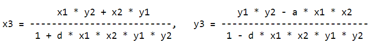

The neutral element in the group is (0,1). Unlike many other curves used for cryptographic applications, these formulas are "complete"; they are valid for all points on the curve, with no exceptions.  In particular, the denominators are non-zero for all input points. There are more efficient formulas, which are still complete, that use homogeneous coordinates to avoid the expensive modulo p inversions.

Ed25519 is EdDSA instantiated with:

**p** 2255 - 19

**b** 256

**encodingof GF(p)** 255-bit little-endian encoding of {0, 1, ..., p-1}

**c** base 2 logarithm of cofactor of edwards25519 in (cofactor of edwards25519 =  8)

**n** 254

**d** 37095705934669439343138083508754565189542113879843219016388785533085940283555

**a** -1

**B** (X(P),Y(P)) of edwards25519

**X(P)** 15112221349535400772501151409588531511454012693041857206046113283949847762202

**Y(P)** 46316835694926478169428394003475163141307993866256225615783033603165251855960

**L** order 2252 + 0x14def9dea2f79cd65812631a5cf5d3ed

**Modular Arithmetic**

For advice on how to implement arithmetic modulo p = 2255 - 19 efficiently and securely, see Curve25519 [9]. For inversion modulo p, it is recommended to use the identity x-1 = x(p-2) (mod p).  Inverting zero should never happen, as it would require invalid input, which would have been detected before, or would be a calculation error. For point decoding or "decompression", square roots modulo p are needed.  They can be computed using the Tonelli-Shanks algorithm or the special case for p = 5 (mod 8).  To find a square root of a, first compute the candidate root x = a((p+3)/8) (mod p).  Then there are three cases:

1) x2 = a (mod p).  Then x is a square root.

2) x2 = -a (mod p).  Then 2((p-1)/4) * x is a square root.

3) a is not a square modulo p.

**Encoding**

All values are coded as octet strings, and integers are coded using little-endian convention, i.e., a 32-octet string h h[0],...h[31] represents the integer h[0] + 28 * h[1] + ... + 2248 * h[31]. A curve point (x,y), with coordinates in the range 0 <mo>&#x2A7D;</mo> x,y < p, is coded as follows.  First, encode the y-coordinate as a little-endian string of 32 octets.  The most significant bit of the final octet is always zero.  To form the encoding of the point, copy the least significant bit of the x-coordinate to the most significant bit of the final octet.

**Decoding**

Decoding a point, given as a 32-octet string, is a little more complicated.

1) First, interpret the string as an integer in little-endian representation.  Bit 255 of this number is the least significant bit of the x-coordinate and denote this value x_0. The y-coordinate is recovered simply by clearing this bit. If the resulting value is <mo>&#x2A7E;</mo> p, decoding fails.

2) To recover the x-coordinate, the curve equation implies x2 = (y2 - 1) / (d*y2 + 1) (mod p).  The denominator is always non-zero mod p.  Let u = y2 - 1 and v = d*y2 + 1. To compute the square root of (u/v), the first step is to compute the candidate root x = (u/v)((p+3)/8).  This can be done with the following trick, using a single modular powering for both the inversion of v and the square root:

x = (u/v)(p+3)/8 = u*v3*(u*v7)(p-5)/8 (mod p)

3) Again, there are three cases:

3.1)  If v*x2 = u (mod p), x is a square root.

3.2)  If v*x2 = -u (mod p), set x <-- x*2((p-1)/4), which is a square root.

3.3)  Otherwise, no square root exists for modulo p, and decoding fails.

4) Finally, use the x0 bit to select the right square root. If x = 0, and x0 = 1, decoding fails.  Otherwise, if x0 <mo>&#x2260;</mo> x mod 2, set x <-- p - x.  Return the decoded point (x,y).

**Point Addition**

For point addition, the following method is recommended. A point (x,y) is represented in extended homogeneous coordinates (X, Y, Z, T), with x = X/Z, y = Y/Z, x*y = T/Z. The neutral point is (0,1), or equivalently in extended homogeneous coordinates (0, Z, Z, 0) for any non-zero Z.

The following formulas for adding two points, (x3,y3) = (x1,y1)+(x2,y2), on twisted Edwards curves with a=-1, square a, and non-square d are described in Section 3.1 of [Edwards-revisited](http://eprint.iacr.org/2008/) and in [EFD-TWISTED-ADD](http://www.hyperelliptic.org/EFD/g1p/auto-twisted-extended-1.html#addition-add-2008-hwcd-3).  They are complete, i.e., they work for any pair of valid input points.

A = (Y1 - X1)*(Y2 - X2)
B = (Y1 + X1)*(Y2 + X2)
C = T1*2*d*T2
D = Z1*2*Z2
E = B-A
F = D-C
G = D+C
H = B+A
X3 = E*F
Y3 = G*H
T3 = E*H
Z3 = F*G

For point doubling, (x3,y3) = (x1,y1)+(x1,y1), one could just substitute equal points in the above (because of completeness, such substitution is valid) and observe that four multiplications turn into squares.  However, using the formulas described in Section 3.2 of [Edwards-revisited](http://eprint.iacr.org/2008/) and in [EFD-TWISTED-ADD](http://www.hyperelliptic.org/EFD/g1p/auto-twisted-extended-1.html#addition-add-2008-hwcd-3) saves a few smaller operations.

A = X12
B = Y12
C = 2*Z12
H = A+B
E = H-(X1+Y1)2
G = A-B
F = C+G
X3 = E*F
Y3 = G*H
T3 = E*H
Z3 = F*G

**Key Generation**

The private key is 32 octets (256 bits, corresponding to b) of cryptographically secure random data.  See [RFC4086](http://www.rfc-editor.org/info/rfc4086) for a discussion about randomness. The 32-byte public key is generated by the following steps.

1) Hash the 32-byte private key, storing the digest in a 64-octet large buffer, denoted h.  Only the lower 32 bytes are used for generating the public key.

2) rune the buffer: The lowest three bits of the first octet are cleared,s the highest bit of the last octet is cleared, and the second highest bit of the last octet is set.

3) Interpret the buffer as the little-endian integer, forming a secret scalar s.  Perform a fixed-base scalar multiplication [s]B.

4) The public key A is the encoding of the point [s]B.  First, encode the y-coordinate (in the range 0 <mo>&#x2A7D;</mo> y < p) as a little- endian string of 32 octets. The most significant bit of the final octet is always zero.  To form the encoding of the point [s]B, copy the least significant bit of the x coordinate to the most significant bit of the final octet.  The result is the public key.

**Sign**

The inputs to the signing procedure is the private key, a 32-octet string, and a message M of arbitrary size.

1) Hash the private key, 32 octets.  Let h denote the resulting digest. Construct the secret scalar s from the first half of the digest, and the corresponding public key A, as described in the previous section.  Let prefix denote the second half of the hash digest, h[32],...,h[63].

2) Compute Hash(M), where M is the message to be signed.  Interpret the 64-octet digest as a little- endian integer r.

3) Compute the point [r]B.  For efficiency, do this by first reducing r modulo L, the group order of B.  Let the string R be the encoding of this point.

4) Compute Hash( R || A), and interpret the 64-octet digest as a little-endian integer k.

5) Compute S = (r + k * s) mod L.  For efficiency, again reduce k modulo L first.

6) Form the signature of the concatenation of R (32 octets) and the little-endian encoding of S (32 octets; the three most significant bits of the final octet are always zero).

**Verify**

1) To verify a signature on a message M using public key A, with F being 0 for Ed25519 and if Ed25519 is being used, C being the context, first split the signature into two 32-octet halves.  Decode the first half as a point R, and the second half as an integer S, in the range 0 <mo>&#x2A7D;</mo> s < L.  Decode the public key A as point A'.  If any of the decodings fail (including S being out of range), the signature is invalid.

2) Compute Hash(R || A), and interpret the 64-octet digest as a little-endian integer k.

3) Check the group equation [8][S]B = [8]R + [8][k]A'.  It's sufficient, but not required, to instead check [S]B = R + [k]A'.

----------

<h3 id="eqhmath">Equihash</h3>

In this section they expose the generalized birthday problem and the algorithm for it by Wagner [6]. The generalized birthday problem for one list is formulated as follows: given list *L* of *n*-bit strings *{Xi}*, find distinct *{Xij}* such that [6]:

*Xi1 <mo>&#x2295;</mo> Xi2 <mo>&#x2295;</mo> ... <mo>&#x2295;</mo> Xi3 = 0*

Wagner considers the setting where *{Xi}* are outputs of some (non-keyed) PRNG, e.g. a hash function *H* in the counter mode. Thus wagner had to find *{ij}* such that [11]:

*H(i1) <mo>&#x2295;</mo> H(i2) <mo>&#x2295;</mo> ... <mo>&#x2295;</mo> H(i3) = 0*

For *k = 1* this problem is the collision search, and can be solved trivially by sorting in *2n/2* time and space complexity if |L| > *2n/2*. However, for *k > 1* and smaller lists the problem is harder. For instance, from the information-theoretic point of view we expect a solution for *k = 2* in a list of size *2n/4*, but no algorithm faster than *2n/3* operations is known [11].

Wagner demonstrated an algorithm for *k > 1* and the lists are large enough to contain numerous solutions. It has time and space complexity of *O(2n/(k+1))* for lists of the same size. Wagner’s algorithm generalizes easily to some operations other than XOR (e.g., to the modular addition). We also note that for *k  log2n* a XOR solution can be found by the much faster Gaussian elimination with complexity of *O(2k)* string operations. the table below adopted from [6] with some modifications explains the basic wagner algorithm for the generalized birthday problem.

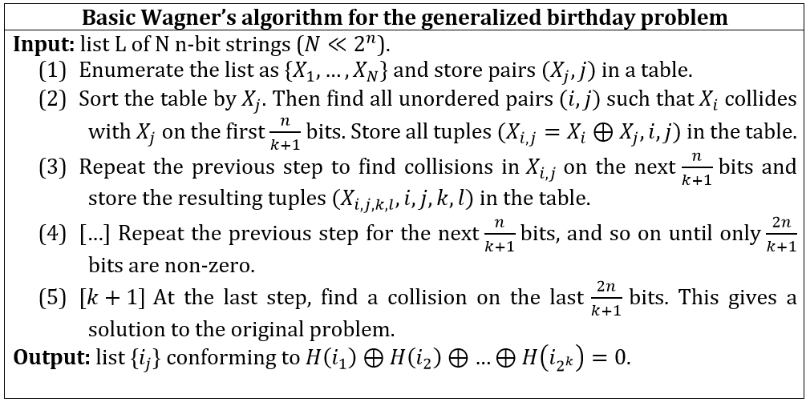

Assume that sorting *l = O(N)* elements is computationally equivalent to *l* calls to the hash function *H*. Let a single call to *H* be our time unit [6].

**Proposition 1.** For *N = 2(n/(k+1))+1* and *k2 < n* Algorithm above produces two solutions (on average) using *(2k-1+n)N/8* bytes of memory in time *(k+1)N* [6].

*Proof.* Suppose they store *N = 2(n/(k+1))+1* tuples at the first step. Then after collision search they expect [6]:

*(N(N - 1)/2)/(N/2) = N - 1*

Entries for the second table, then *N - 3* entries for the third table, and so on. Before the last (k-th) collision search they expect *N - 2k-1+1 is approximatly N = 2(n/(k+1))+1* entries, thus on average we obtain two solutions after the last step. The computational complexity is dominated by the complexity of list generation (N hash calls) and subsequent k sortings of N elements. Therefore, the total computational complexity is equivalent to [6]:

*(k + 1)N = (k + 1)N = 2(n/(k+1))+1*

Hash function calls. This ends the proof [6]. they have not computed the variance of the number of solutions, but their experiments demonstrate that the actual number of solutions at each step is very close (within 10%) to the expected number. If larger lists are used, the table will grow in size over the steps. We have taken the list size  exactly so that the expected number of solutions is small and the table size does not change much [6].

The generalized birthday problem in its basic form lacks some necessary properties as a proof-of-work. The reason is that Wagner’s algorithm can be iterated to produce multiple solutions by selecting other sets of colliding bits or using more sophisticated techniques . If more memory is available, these solutions can be produced at much lower amortized cost (Proposition 3). Since this property violates the non-amortization requirement for the PoW (see [6]), they suggest modifying the problem so that only two solutions can be produced on average [6].

Our modification is inspired by the fact that a solution found by Wagner’s algorithm carries its footprint. Namely, the intermediate *2l-XORs* have leading *nl/(k+1)* bits, for example Xi4 <mo>&#x2295;</mo> Xi5 <mo>&#x2295;</mo> Xi6 <mo>&#x2295;</mo> Xi7 collide on certain *2n/k+1* bits. Therefore, if we pre-fix the positions where *2l-XORs* have zero bits, they bind the user to a particular algorithm flow. Moreover, they can prove that the total number of possible solutions that conform to these restrictions is only 2 on average, so that the problem becomes amortization-free for given input list *L*. they only have to take care of duplicate solutions which appear if they swap *2l-XORs* within the *2l-XORs*, for any *l*. We simply require that every *2l-XORs* is ordered as a pair, e.g. with lexicographic order. they stress that a certain order is a prerequisite as otherwise duplicate solutions (produced by swaps in pairs, swaps of pairs, etc.) would be accepted [6].

With this modification the Gaussian elimination algorithm does not apply any longer, so they can use larger k with no apparent drop in complexity [6].

**Proposition 2** Optimized Wagner’s algorithm below which adopted from [6] with some changes:

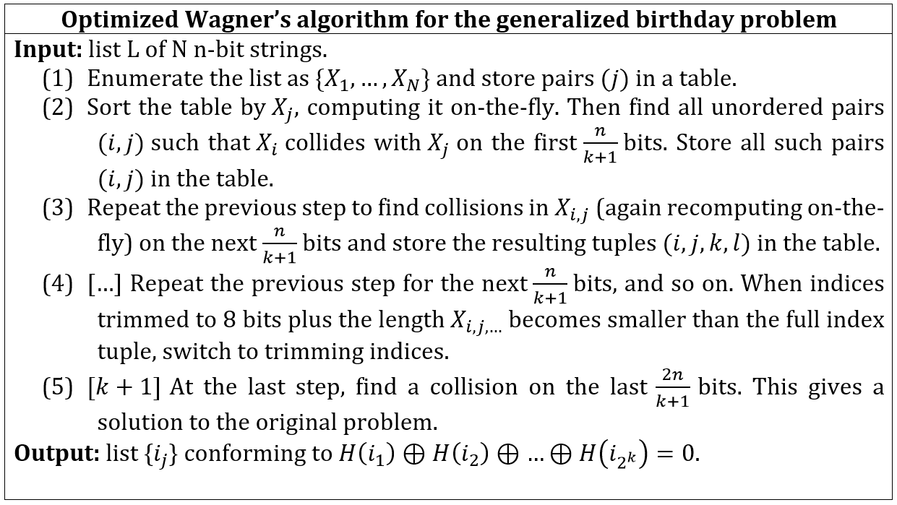

for *N = 2(n/(k+1))+1* runs in *M(n, k) = 2(n/(k+1))(22+(n/2(k+1))* bytes of memory and *T(n, k) = k2(n/(k+1))+2* time [6].

**Proposition 3** Using qM(n;k) memory, a user can find *2qk+1* solutions with cost *qT(n, k)*, so that the amortized cost drops by *qk+1* [6].

**Proposition 4** Using *M(n, k) = q* memory, a user can find 2 solutions in time *C1(q)T(n,k)*, where [6]:

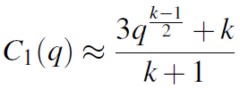

Therefore, Wagner’s algorithm for finding *2k-XOR* has a tradeoff of steepness *(k-1)/2*. At the cost of increasing the solution length, we can increase the penalty for memory-reducing users [6].

**Proposition 5** Using constant memory, a user can find one algorithm-bound solution in time [6]:

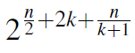

**Proposition 6** Using *M(n, k)/q* memory, a user can find 2 algorithm-bound solutions in time *C2(q)T(n, k)*, where [6]:

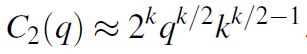

Therefore, the algorithm-bound proof-of-work has higher steepness (k/2), and the constant is larger. Thus far they have equalized the time and computational complexity, whereas an ASIC-equipped user or one with a multi-core cluster would be motivated to parallelize the computation if this reduces the AT cost [6].

**Proposition 7** With *p <mo>&#x226A;</mo> T(n, k)* processors and *M(n, k)* shared memory a user can find 2 algorithm-bound solutions in time.

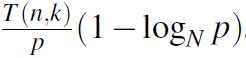

Additionally, the memory bandwidth grows by the factor of p. For fixed memory size, memory chips with bandwidth significantly higher than that of typical desktop memory (such as DDR3) are rare. Assuming that a prover does not have access to memory with bandwidth higher than certain Bwmax, we can efficiently bound the time-memory (and thus the time-area) product for such implementations [6].

To generate an instance for the proof protocol, a verifier selects a cryptographic hash function *H* and integers *n, k, d* which determine time and memory requirements as follows [6]:

- Memory M is *2(n / (k+1)) + k*
- Time T is *(k + 1)2(n / (k+1)) + d* calls to the hash function H.
- Solution size is *2k((n / (k+1)) + 1) + 160* bits.
- Verification cost is 2k hashes and XORs.

Then he selects a seed I (which may be a hash of transactions, block chaining variable, etc.) and asks the prover to find 160-bit nonce V and ((n/k+1) +1)-bit x1, x2, ..., x2k such that [6]:

**Generalized Birthday - Condition**

H(I||V||x1) <mo>&#x2295;</mo> H(I||V||x2) <mo>&#x2295;</mo> ... <mo>&#x2295;</mo> H(I||V||x2k) = 0,

**Difficulty - Condition**

H(I||V||x1||x2||...||x2k) *has d leading zeroes*

**Algorithm Binding - Condition**

H(I||V||xw2l+1) <mo>&#x2295;</mo> ... <mo>&#x2295;</mo> H(I||V||xw2l+2l-1) has *nl/(k+1)* leading zeroes for all *w,l*

*(xw2l+1||xw2l+2||...||xw2l+2l-1)<(xw2l+2l-1+1||xw2l+2l-1+2||...||xw2l+2l)*

Here the order is lexicographical. A prover is supposed to run Wagner’s algorithm and then H [6].

For more information about the equihash and proof of propositions please, see reference [6].

----------

<h1 id="HTGSG">How to get started with it?</h1>

In this section we will introduce the packages related to each algorithm, parameters required to use them and the test results. each section as a subsection introducing the test vectors or testing parameters.

----------

<h2 id="LGSB2">Let's get started with Blake2-Node.js-Addon</h2>

In this section we will compare the pewrformance of two sets of packages created for blake2. These packages which are forked from other projects one is the **Pure JavaScript** implementation of Blake2 and the other one is Node.js C/C++ Addon created for Blake2. The difference is cristal clear in the name, but the differences are what we are going to show you in the sections below. Our package is in accordance with Blake2 [RCF 7693](https://tools.ietf.org/html/rfc7693) Standard, the final results also compared as well; more test vectores can be accessed there as well.

----------

<h3 id="LGSB2PJ">Blake2 Pure JavaScript-Node-Addon</h3>

This packages which is forked and created from other projects, is tested for generating hash using blake2b and blake2s. A JavaScript code is created to test the performance of the package which is available at <a href="#APPX1">Appendix1: Blake2b-PureJava-test</a>. The result of hashing **abc** as the input string presented below:

>ba80a53f981c4d0d6a2797b69f12f6e94c212f14685ac4b74b12bb6fdbffa2d17d87c5392aab792dc252d5de4533cc9518d38aa8dbf1925ab92386edd4009923

The picture below is the test result of **abc** published in [RCF 7693](https://tools.ietf.org/html/rfc7693):

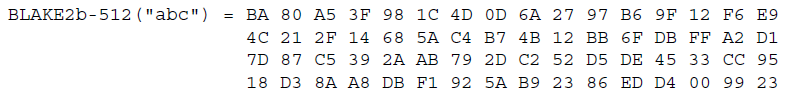

The result of calculating the number of hashes blake2b - Pure JavaScript can generate: **219,743** Blake2b with the digest length of 512 bits in 5 second.

Performing the same test for the blake2s, with the input vertor of **abc** and by developing a JavaScript code available at <a href="#APPX2">Appendix2: Blake2s-PureJava-test</a>.

> 508c5e8c327c14e2e1a72ba34eeb452f37458b209ed63a294d999b4c86675982

The picture below is the test result of **abc** published in [RCF 7693](https://tools.ietf.org/html/rfc7693):

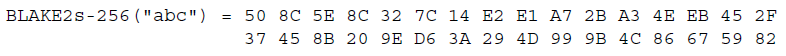

The result of calculating the number of hashes blake2s - Pure JavaScript can generate: **450,680** Blake2s with the digest length of 256 bits in 5 second.

----------

<h3 id="LGSB2CA">Blake2 C/C++ Node-Addon</h3>

This package is forked from from other projects and developed to create a C/C++ Node.js Addon. The difference is JavaScript packages are slower as JavaScript is a high level programming language. The main platform in TrustNote is Node.js; Therefor to have the best performance while using the basis platform we are required to create a C/C++ Addon. Consequently, we will use JavaScript as the interface and do our calculation in C/C++ core which this favors the performance. We will present the performance of the the same functions with the same inputs in this package.

Same as previous section the test is to create hash using blake2b and blake2s with the digest length of 512 and 256 respectively. A JavaScript code is created to test the performance of the package which is available at <a href="#APPX3">Appendix3: Blake2b-C/C++ Node.js-Addon-test</a>. The result of hashing **abc** as the input string presented below:

>ba80a53f981c4d0d6a2797b69f12f6e94c212f14685ac4b74b12bb6fdbffa2d17d87c5392aab792dc252d5de4533cc9518d38aa8dbf1925ab92386edd4009923

The picture below is the test result of **abc** published in [RCF 7693](https://tools.ietf.org/html/rfc7693):

The result of calculating the number of hashes blake2b - Pure JavaScript can generate: **6,605,304** Blake2b with the digest length of 512 bits in 5 second.

Performing the same test for the blake2s, with the input vertor of **abc** and by developing a JavaScript code available at <a href="#APPX4">Appendix4: Blake2s-C/C++ Node.js-Addon-test</a>.

> 508c5e8c327c14e2e1a72ba34eeb452f37458b209ed63a294d999b4c86675982

The picture below is the test result of **abc** published in [RCF 7693](https://tools.ietf.org/html/rfc7693):

The result of calculating the number of hashes blake2s - Pure JavaScript can generate: **7,128,410** Blake2s with the digest length of 256 bits in 5 second.

**Therefor**, it is crystal clear that C/C++ Addon generates **6,605,304**  hashes for Blake2b and **7,128,410** hashes for Blake2s with maximum digest length while Pure JavaScript generates only **219,743** hashes for Blake2b and **450,680** hashes for Blake2s.

----------

<h2 id="LGSEd">Let's get started with Ed25519-Node-Addon</h2>

The previous chapter showed that it's a waste of time to use Pure JavaScript packages for the project. Therefor, we will present the C/C++ Addon performance only for this package. The JavaScript code Developed to test this package which is forked from other projects, is available at  <a href="#APPX5">Appendix5: Ed25519-C/C++ Node.js-Addon-test</a>.

During 5 seconds, this package generates, signs and verifies **4,198** keys. This package presents an amazing performance.

----------

<h2 id="LGSEqh">Let's get started with Equihash</h2>

This package is forked from other projects. This package will be performed in C/C++ platform. we will test this package with different inputs and, the outcomes will be presented in the table below:

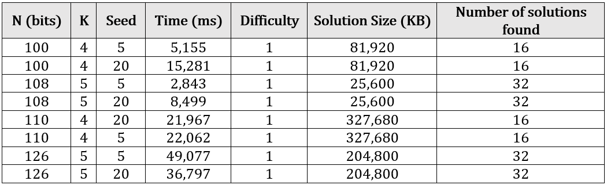

<h1 id="Diss">Discussion</h1>

This document aimed to introduce the most important subjects which directly effecting the security and performance of the final product. Eventually, TrustNote will be manipulating Blake2 as its hash function, Ed25519 as its public key generator for signing contracts and Equihash for verification. As mentioned before, this is a work-in-progress so if we find any newer and better algorithm which gurantees security of the users while offering a higher performance, we will replace it with our current packages.

----------

<h1 id="ref">References</h1>

[1] Shu-jen Chang, Ray Perlner, William E. Burr, Meltem S¨onmez Turan, John M. Kelsey, Souradyuti Paul, and Lawrence E. Bassham. Third-Round Report of the SHA-3 Cryptographic Hash Algorithm Competition. NISTIR 7896, National Institute for Standards and Technology, November 2012.

[2] Jean-Philippe Aumasson, Samuel Neves, Zooko Wilcox-O’Hearn, Christian Winnerlein. BLAKE2: simpler, smaller, fast as MD5. URL: (https://blake2.net/blake2.pdf), January, 2013.

[3] https://blake2.net/.

[4] https://vijaypradeep.com/blog/2017-04-28-ethereums-memory-hardness-explained/.

[5] Alex Biryukov and Dmitry Khovratovich (2016). "Equihash: asymmetric proof-of-work based on the Generalized Birthday problem". University of Luxembourg. URL: (https://www.internetsociety.org/sites/default/files/blogs-media/equihash-asymmetric-proof-of-work-based-generalized-birthday-problem.pdf).

[6] Daniel J. Bernstein, Niels Duif, Tanja Lange, Peter Schwabe, Bo-Yin Yang. High-speed high-security signatures. Journal of Cryptographic Engineering 2 (2012), 77–89. URL: https://cr.yp.to/papers.html#ed25519. Date: 2011.09.26.

[7] Ed25519: high-speed high-security signatures. URL: https://ed25519.cr.yp.to/.

[8] Elliptic Curves for Security. URL: https://tools.ietf.org/html/rfc7748.

[9] Edwards-Curve Digital Signature Algorithm. URL: https://tools.ietf.org/html/rfc8032.

[10] Bernstein, D., "Curve25519: new Diffie-Hellman speed records", DOI 10.1007/11745853_14, February 2006, <http://cr.yp.to/ecdh.html>.

[11] Wagner, D. “A Generalized Birthday Problem.” Lecture Notes in Computer Science 2442 (2002) 288–303 doi:10.1007/3-540-45708-9 19.

----------

<h1 id="APPX">Appendices</h1>

<h2 id="APPX1">Appendix1: Blake2b-PureJava-test</h2>

	'use strict';
	var startTime = new Date().getTime();
	var count = 0;
	var TD = 0;
	var test = require('tape')
	var blake2b = require('./blake2b')
	var util = require('./util')
	var fs = require('fs')
	var blake2bHex = blake2b.blake2bHex
	var hash = blake2bHex('abc');
	console.log('blake2b result for input array "abc"');
	console.log(hash.toString('hex'));
	var endTime = new Date().getTime();
	TD = endTime  - startTime;
	while ((endTime  - startTime) < 5000){
		var hash = blake2bHex('abc');
		var endTime = new Date().getTime();
	  	count++;}
    console.log('Number of hashes generated during 5 seconds:');
	console.log(count)

<h2 id="APPX2">Appendix2: Blake2s-PureJava-test</h2>

	'use strict';
	var startTime = new Date().getTime();
	var count = 0;
	var TD = 0;
	var test = require('tape')
	var toHex = require('./util').toHex
	var util = require('./util')
	var b2s = require('./blake2s')
	var blake2s = b2s.blake2s
	var blake2sHex = b2s.blake2sHex
	var blake2sInit = b2s.blake2sInit
	var blake2sUpdate = b2s.blake2sUpdate
	var blake2sFinal = b2s.blake2sFinal
	var hash = blake2sHex('abc');
	console.log('blake2s result for input array "abc"');
	console.log(hash.toString('hex'));
	var endTime = new Date().getTime();
	TD = endTime  - startTime;
	while ((endTime  - startTime) < 5000) {
		var hash = blake2sHex('abc');
		var endTime = new Date().getTime();
	    count++;}
	console.log('Number of hashes generated during 5 seconds:');
	console.log(count)

<h2 id="APPX3">Appendix3: Blake2b-C/C++ Node.js-Addon-test</h2>

	'use strict';
	var startTime = new Date().getTime();
	var count = 0;
	var TD = 0;
	var
	demand = require('must'),
	fs        = require('fs'),
	path      = require('path'),
	Blake2    = require('./index')
	;
	var startTime = new Date().getTime();
	var count = 0;
	var TD = 0;
	var assert = require('assert');
	var buf = new Buffer('abc');
	var hash = Blake2.sumBuffer(buf, Blake2.ALGORITHMS.B);
	assert(hash instanceof Buffer);
	console.log('blake2b:');
	console.log(hash.toString('hex'));
	var endTime = new Date().getTime();
	TD = endTime  - startTime;
	while ((endTime  - startTime) < 5000) {
		var hash = Blake2.sumBuffer(buf, Blake2.ALGORITHMS.B);
		assert(hash instanceof Buffer);
		var endTime = new Date().getTime();
	    count++;}
    console.log('Number of hashes generated during 5 seconds:');
	console.log(count)

<h2 id="APPX4">Appendix4: Blake2s-C/C++ Node.js-Addon-test</h2>

	'use strict';
	var startTime = new Date().getTime();
	var count = 0;
	var TD = 0;
	var assert = require('assert');
	var buf = new Buffer('abc');
	var hash2 = Blake2.sumBuffer(buf, Blake2.ALGORITHMS.S);
	assert(hash2 instanceof Buffer);
	console.log('blake2s:');
	console.log(hash2.toString('hex'));
	var endTime = new Date().getTime();
	TD = endTime  - startTime;
	while ((endTime  - startTime) < 5000) {
		var hash2 = Blake2.sumBuffer(buf, Blake2.ALGORITHMS.S);
		assert(hash2 instanceof Buffer);
		var endTime = new Date().getTime();
		count++;}
	console.log('Number of hashes generated during 5 seconds:');
	console.log(count)

<h2 id="APPX5">Appendix5: Ed25519-C/C++ Node.js-Addon-test</h2>

	'use strict';
	var test = require('tape')
	var ed = require('./')
	var bindings = require('./build/Release/supercop.node')
	var startTime = new Date().getTime();
	var count = 0;
	var TD = 0;
	test('generate, sign, and verify', function (t) {
	  var endTime = new Date().getTime();
	  TD = endTime  - startTime;
	  while ((endTime  - startTime) < 5000) {
	  t.plan(7)
	  var seed = ed.createSeed()
	  t.equal(seed.length, 32)
	  var kp = ed.createKeyPair(seed)
	  t.equal(kp.publicKey.length, 32)
	  t.equal(kp.secretKey.length, 64)
	  var msg = 'whatever'
	  var sig = ed.sign(msg, kp.publicKey, kp.secretKey)
	  var xsig = xmod(sig)
	  var xmsg = xmod(msg)
	  var xpk = xmod(kp.publicKey)
	  t.ok(ed.verify(sig, msg, kp.publicKey))
	  t.notOk(ed.verify(xsig, msg, kp.publicKey))
	  t.notOk(ed.verify(sig, xmsg, kp.publicKey))
	  t.notOk(ed.verify(sig, msg, xpk))
	  var endTime = new Date().getTime();
	  count++;}
	console.log('Number of hashes generated during 5 seconds:');
	console.log(count)
	})

	function xmod (buf) {
	  var cp = Buffer(buf)
	  cp[0] = ~cp[0]
	  return cp}
