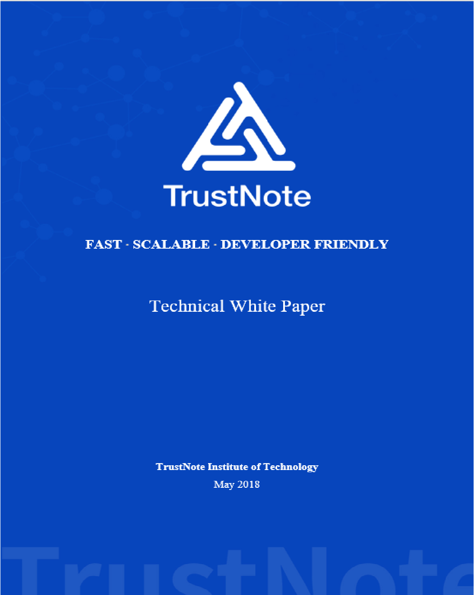

<html>
<div align="center">

<p><a target="_blank" href="images/TrustNote-Whitepaper-Cover.png"></a></p>

</div>

------

<div align="justify">

<font face="cambria" size="3">

<h1><b>Overview</b></h1>

<p>Today’s block chain technologies face many challenges such as network congestion, high transaction fees, and long delay in transaction confirmation. TrustNote seeks to address these problems by building the world-leading public Directed Acyclic Graph (DAG) ledger which is minable, capable of handling high concurrent transactions yet still maintain quick transaction confirmation. TrustNote is focused on creating an easy-to-use, decentralized, low-level digital token block chain that leverages declarative Smart Contracts with enhanced expression capability, while empowering users to create and publish digital tokens without having to write complex Smart Contracts. TrustNote has an extensible wallet that provides security and rich API interfaces for digital tokens, block chain games and social networks, which allowing new innovative ideas to run smoothly on the block chain network and making user friendly block chain applications accessible to everyone. This document introduces TrustNote’s technical characteristics, user scenarios, and detail about token issuance and so on. For more in depth information about materials included in this document, please visit  <a href="https://github.com/trustnote/document" target="_blank" rel="external">https://github.com/trustnote/document. </a></p>

<h1><b>Disclaimer</b></h1>
<p>TrustNote Institute of Technology hereby declares that: The current package is experimental and a work-in-progress, and you are using TrustNote at your own risk.  TrustNote also declares that we might change (add/remove packages) without informing the users.  In addition, because of the existence of “private equity” scams targeting crypto-currency investors, TrustNote hereby declares that participation in crypto-currency investment through unauthorized trading channels should always take precautionary measures against such risks.  Neither TrustNote Institute of Technology nor the TrustNote Development Team take responsibility for any consequences of investments via unauthorized trading channels. Finally, we declare that, TrustNote White paper can be only accessed from:</P>
<ul>
<li><p><a href="https://github.com/trustnote/document" target="_blank" rel="external">https://github.com/trustnote/document</a></p></li>
<li><p><a href="https://trustnote.org/" target="_blank" rel="external">https://trustnote.org/</a></p></li>
</ul>
<p>We do not guarantee the faulty or misleading data available in documents downloaded from any other website rather than two official websites introduced above.</P>

<h1><b>Contact Us</b></h1>
<ul>
<li><p>Business Enquiries:  <a href="foundation@trustnote.org" target="_blank" rel="external">foundation@trustnote.org</a></p></li>
<li><p>Technical Support:  <a href="community@trustnote.org" target="_blank" rel="external">community@trustnote.org</a></p></li>
</ul>

<p><b>© 2018 TrustNote Institute of Technology. All rights reserved.</b></p>

</font>
</div>

------

<div id="toc_container" align="left">
<font face="cambria" size="3">

<h1><b>Contents</b></h1>
<ul class="toc_list">
  <p><a href="#BACKGROUND">1. BACKGROUND</a></p>
  <p><a href="#WHAT-IS-TRUSTNOTE?">2. WHAT IS TRUSTNOTE?</a></p>
    <ul><p><a href="#KEY-FEATURES">2.1. KEY FEATURES</a></p>
    <p><a href="#DIRECTED-ACYCLIC-GRAPH">2.2. DIRECTED ACYCLIC GRAPH</a></p>
    <p><a href="#COMPARISON">2.3. COMPARISON</a></p></ul>
  <p><a href="#DATA-STRUCTURES">3. DATA STRUCTURES</a></p>
    <ul><p><a href="#UNIT">3.1. UNIT</a></p>
    <p><a href="#MESSAGE-TYPES">3.2. MESSAGE TYPES</a></p></ul>
  <p><a href="#CONSENSUS">4. CONSENSUS</a></p>
    <ul><p><a href="#NODES">4.1. NODES</a></p>
    <p><a href="#UNIT-INTER-REFERENCE">4.2. UNIT INTER-REFERENCE</a></p>
    <p><a href="#MAIN-CHAIN">4.3. MAIN CHAIN</a></p>
    <p><a href="#TRANSACTION-CONFIRMATION">4.4. TRANSACTION CONFIRMATION</a></p>
    <p><a href="#TRANSACTION-FEES-AND-MINING-REWARD">4.5. TRANSACTION FEES AND MINING REWARD</a></p>
    <p><a href="#TRUSTME-POW">4.6. TRUSTME-POW</a></p>
    <p><a href="#TRUSTME-BA">4.7. TRUSTME-BA</a></p>
      <ul><p><a href="#Design-Goals">4.7.1. Design Goals</a></p>
      <p><a href="#Final-Consensus-and-Tentative-Consensus">4.7.2. Final Consensus and Tentative Consensus</a></p>
      <p><a href="#Lottery-Algorithm">4.7.3. Lottery Algorithm</a></li>
       <p><a href="#Byzantine-Agreement">4.7.4. Byzantine Agreement</a></p></ul></ul>
  <p><a href="#SMART-CONTRACT">5. SMART CONTRACT</a></li>
  <p><a href="#TRUSTNOTE-PLATFORM-AND-APPLICATIONS">6. TRUSTNOTE PLATFORM AND APPLICATIONS</a></p>
  <p><a href="#ISSUANCE-AND-DISTRIBUTION">7. ISSUANCE AND DISTRIBUTION</a></p>
  <p><a href="#REFERENCES">8. REFERENCES</a></p>
  <p><a href="#NOTICESANDDISCLAIMERS">9. NOTICES AND DISCLAIMERS</a></p>
</ul>
</font>
</div>

------

<div align="justify">

<font face="cambria" size="3">
  
<h1><a id="BACKGROUND"></a>1. BACKGROUND</h1>
<p>For about 10 years, since January the 3<sup>rd</sup>, 2009, Bitcoin has been operating safely, a miracle in the history of computer network technology. The success of Bitcoin unlocked the doors to the future of the world’s economy for digital crypto-currencies; a new world full of imagination. Satoshi Nakamato creatively proposed the Blockchain - a chained data structure based on hash functions - and succeeded in building a well-operated, decentralized peer to peer network which opened the new era of digital crypto-currencies.  Blockchain technologies are developing fast, driving change across many industries, sparking innovation and creativity.</p>
<p>Blockchain has provided a decentralized trust mechanism and has become a brand-new paradigm and key methodology in data protection and data value exchange.  Now in its booming period, blockchain is constantly being integrated with various technologies, various scenarios are also being explored in terms of how to utilize the technical characteristics of blockchain, blockchain applications have been expanded from data tamper resistance and data value exchange to digital tokens and social-networking arenas.  The growing number of blockchain user scenarios pose many challenges for blockchain technology, demanding stronger security, higher transaction concurrency, and shorter transaction acknowledgment delay.</p>
<p>In Bitcoin's blockchain, all the data blocks are aligned in one continuous chain, but due to the limitations on block size and consensus mechanism, the amount of concurrent transactions is limited and transaction confirmations are slow, which resulting in the rise of transaction fees and frequent trading congestions.  To address these issues, the Bitcoin developer community has come up with solutions such as increasing block size, segregated witness, and lightning networks, but none of them is perfect.  Those solutions either just ease the problem, or sacrifice security or consistency, and none of them have reached full agreement within the community.  The recent emergence of multiple bitcoin forks, has heated up the debate even further.</p>
<p>The structure of the ‘traditional’ blockchain is the bottleneck that hinders the technology from improving its concurrency. More efficient forms of distributed ledger technology are being sought and a solution which combines Directed Acyclic Graph (DAG) and blockchain (hereinafter referred to as "DAG-ledger") was proposed.  The DAG-ledger has no concept of blocks, so there is no limit to the size of the blocks.  In addition, DAG-ledger uses a new form of transaction verification which referencing the old transaction for transaction confirmation. This allows minor temporary differences between the users’ ledgers, to achieve the goal of preventing transaction obstruction by weakening the consistency of the entire network in a short period. The larger the network is and the greater the transaction volumes are, the shorter the transaction confirmation delay is.</p>
<p>IOTA and Byteball both developed their own public DAG-ledgers in 2015 and 2016 respectively, to accommodate high-frequency trading scenarios. However, the downside is that although DAG-ledger supports high-frequency trading, in the case of low-frequency trading, the old transaction cannot get enough new transactions to verify and reference, resulting in the old transaction not being confirmed in time, in extreme cases the transaction may never get confirmed. To address this problem, IOTA proposes a temporary centralized actor called coordinator, which is used to protect the network when the volume of transactions is low, however IOTA does not disclose the design details of such coordinator; Byteball introduces twelve witnesses, implementing transaction confirmation via witness attestation, although Byteball claims its users have the right to choose their own witness, but the transaction quoting rules make it very difficult for users to change witnesses if they choose to do so. TrustNote resolved all these issues by proposing a robust and innovative design. </p>

<h1><a id="WHAT-IS-TRUSTNOTE?"></a>2. WHAT IS TRUSTNOTE?</h1>
<p>TrustNote is a minable public DAG-ledger with an innovative, two-tier consensus mechanism designed for new applications such as digital tokens issuance, blockchain games and social networks. Its digital token is called “<b>TTT</b>”.  TrustNote's goal is to be Fast, Scalable, and Developer Friendly. TrustNote has a light architecture and intelligent contract system that supports lightweight application extensions and micro wallets. Even more, TrustNote supports high concurrency transactions, which results in fast transaction confirmation, and makes development and deployment of distributed application (DApp) much easier. Last but the best, TrustNote platform allows new innovative ideas to run smoothly on the ledger, and making user-friendly DApps accessible to everyone. For more detail about TrustNote Infrastructure and Fundamental protocols please, visit <p><a href="https://github.com/trustnote/document/blob/master/TrustNote-TR-2018-03.pdf" target="_blank" rel="external">TrustNote Tech Stack</a></p>

<h2><a id="KEY-FEATURES"></a>2.1. Key Features</h2>
<ul>
 	<li>Two-tier consensus mechanism, a minable public DAG-ledger. </li>
 	<li>Supports high concurrency transactions, benefits from fast transaction confirmation.</li>
 	<li>Supports advanced declarative Smart Contracts.</li>
 	<li>Token issuance system.</li>
 	<li>Cryptographic Algorithm: BLAKE2, BIP32-Ed25519 (For more in depth information about TrustNote Cryptographic Algorithms please, visit <a href="https://github.com/trustnote/document/blob/master/TrustNote-TR-2018-01.pdf" target="_blank" rel="external">TrustNote-TR-01 Report</a>).</li>
 	<li>Multi-platform wallet, light wallet, micro wallet, support third-party extensions.</li>
</ul>

<h2><a id="DIRECTED-ACYCLIC-GRAPH"></a>2.2. Directed Acyclic Graph</h2>

<p>A Directed Acyclic Graph (DAG), is a finite directed graph with no directed cycles. It consists of finitely many vertices and edges, with each edge directed from one vertex to another, such that there is no way to start at any vertex V and follow a consistently-directed sequence of edges that eventually loops back to V again. The use of the DAG data structure to store ledger data is gradually grabbing more developers’ attention.  Projects like IOTA and Byteball have successfully established stable public-ledgers using DAG, the feasibility of a DAG-ledger is proven.</p>

<p>In TrustNote terms, transactions are viewed as messages. Various types of messages are supported, multiple messages can be combined into a data block which is called a “<b>Unit</b>”, and a DAG is formed by inter-referenced Units. Since each Unit must reference multiple previous Units, there is no need to spend more computing power and time for solving the consensus problem, nor need to wait for the completion of strong inter-node data synchronization, and because there is no need to assemble multiple Units into blocks, the performance of concurrent transactions is considerably improved and the confirmation delay are reduced to minimum.</p>
</font>
</div>

<div align="center">
<p><a target="_blank" href="images/TrustNote-Whitepaper-DAG Graph.png"></a></p>
  <p><b>Figure 2-1 DAG Graph</b></p>
</div>

<div align="justify">

<font face="cambria" size="3">

<p>TrustNote uses the following technique to solve the double-spending problem (double-spending is a problem unique to digital currency in which the same single digital token can be spent more than once). First, try to find a Main Chain (MC) starting from Genesis Unit on the DAG and assign indexes to the Units that located on the MC, the Genesis Unit’s index is 0, and so on.  Second, for those Units that do not located on the MC, define their indexes equal to the first MC Unit references this Unit. Eventually, every transaction on the DAG has an index. If two transactions try to use the same output, we just need to compare the value of their indexes named Main Chain Index (MCI). The Unit with a smaller index is valid, the Unit with a larger index is invalid, and thus it solves the double-spending problem.  For example, when double-spending occurs (as shown in figure 2-2), after the MCIs are assigned to each transaction, we can determine the transaction whose MCI is 7 is valid, the other transaction whose MCI is 9 is rejected.</p>
</font>
</div>

<div align="center">
<p><a target="_blank" href="images/TrustNote-Whitepaper-Main Chain.png"></a></p>
  <p><b>Figure 2-2 Main Chain (MC)</b></p>
</div>

<div align="justify">

<font face="cambria" size="3">  
  
<p>For security concerns, unlike Bitcoin’s blockchain which is guaranteed by the massive computing power of the network, DAG based TrustNote relies on the fast advance of transactions and the uncertainty of the relationship between the transactions as the "<b>firewall</b>", which leaves the entire system looks too lawless to be attacked. TrustNote benefits from a two-tier consensus mechanism and an innovative TrustME Consensus Algorithm. Those Super Nodes that participate in the TrustME consensus and contribute to the healthy expansion of DAG-ledger will get the mining reward.</p>

<h2><a id="COMPARISON"></a>2.3. Comparison</h2>
<p>Standing on the shoulders of giants, absorbs the advantages of existing blockchain projects and addresses their major issues, a more prosperous TrustNote platform becomes possible. A comparison of current well-known DAG-ledgers (IOTA and Byteball) with TrustNote is shown in Table 2-1.</p>  
  
</font>
</div>

<div align="center">
<p><b>Table 2-1 DAG-Ledger Comparison</b></p>
  </div>
  
<div align="center"> 
  
|  |	<b>IOTA</b> |	<b>Byteball</b>	| <b>TrustNote</b> |
| :---: | :---: | :---: | :---: |
| <b>Token</b>	| IOTA	| Byte |	TTT |
| <b>Consensus Mechanism</b> |	PoW Cumulative Weight |	12 Witnesses |	Decentralized TrustME Consensus Mechanism |
| <b>Smart Contract</b>	| No |	Declarative Contract |	Advanced Declarative Contract |
| <b>Reward</b>	| No	| Transaction Reference and Attestation	| Transaction Reference and Mining |
| <b>Nodes</b>	| Full Node, Light Node	| Full Node, Light Node |	Super Node, Full Node, Light Node, Micro Node |
| <b>Transaction Fee</b> |	No |	Yes |	Yes |
| <b>Double Spending</b> | 	PoW Weight Comparison |	Main Chain Sequencing |	Main Chain Indexing|
| <b>Low-frequency Trading</b> |	Centralized Coordinator |	Weak Centralized Attestor	| TrustME Attestor|

   </div>


<div align="justify">
<font face="cambria" size="3">  

<h1><a id="DATA-STRUCTURES"></a>3. DATA STRUCTURES</h1>

<h2><a id="UNIT"></a>3.1. Unit</h2>
<p>When a Node initiates a transaction or sends a message, it creates a new data block called a "<b>Unit</b>" and broadcasts the Unit to its peers. A Unit may contain multiple messages of various types, each Unit contains the following information:</p>
<ul>
  <li>Header: The hash value of the previous Unit (parent).</li>
<li>Messages: A Unit contains one or more messages, there are various types of message, and each message type has its own unique data structure.</li>
<li>Signatures: A Unit contains one or more users’ signatures.</li>  
<li>Address: A user can have multiple addresses; the addresses are generated with BIP-0044 algorithm.</li>
  </lu>
<p>Definition of each Unit’s field is shown in table 3-1.</p>
</font>
</div>

<div align="center">
<p><b>Table 3-1 Field Definition of Unit</b></p>
</div>

<div>
<center>
  
 | Field Name |	Definition |	Remarks |
 |--------------|-------------------------|------------------------------|
 | <b>version</b> |	TrustNote protocol version number |	e.g. ‘1.0’ |
 | <b>alt</b> |	Token identification |	e.g. ‘1’ |
 | <b>messages</b> |	Message array |	for more information please see 2.2 |
 | <b>authors</b> |	Author array |	Address array of the Unit’s author/authors |
 | <b>parent_units</b> |	Parent Unit’s hash array |	Hash values of the Unit’s parent/parents |

</center>
</div>
<div align="justify">
<font face="cambria" size="3"> 

<p>The message’s field stores the actual data of the Unit, it is an array of one or more messages. TrustNote supports various types of messages which are distinguished by the app field.</p>
</font>
</div>

<div align="center">
  
<p><b>Table 3-2  Field Definition of messages</b></p>
</div>

<div align="center">

| Field Name | Definition | Remarks |
| --- | :---: | :---: |
| <b>app</b> | Message type |	e.g. “payment” or “text”, for more information please see 2.2 |
| <b>payload_location</B> | Location of the message body | “inline” indicates the message body is stored in the current message; “uri” indicates the message body is retrievable from a URL address; “none” indicates there is no message body |
| <b>payload_hash</b> |	Hash value of the message body	|   |
| <b>Payload</b> | Message body	| Various message types are used to kept different data format, e.g. a transaction message includes various number of input and output |
| <b>payload_input</b> | Message input array	| Includes the hash value of the Unit who generated the message, message index, output index etc. |
| <b>payload_output</b> |	Message output array | Includes addresses of recipients, amount of transaction and etc.|

</div>

<div align="justify">
<font face="cambria" size="3"> 

<h2><a id="MESSAGE-TYPES"></a>3.2. Message Types</h2>
<p>TrustNote supports various message types which can be further extended if needed, different types of messages are used to store different data formats interpretable by different parsing rules.  Different types of TrustNote message are recognizable by the message’s app field.</p>

<h3>Mine Solution (app = PoW-Equihash)</h3>
<p>“<b>PoW-Equihash</b>” message is generated by Super nodes, PoW messages are used to store the Equihash result and determine the Attestors for each consensus round. If a Unit contains a PoW message, then this unit is a PoW unit. Even more, the priority of Attestors in each consensus round is determined based on the sequence of stabilization of PoW units. The contents of PoW message includes: consensus round’s number, seed, difficulty, Equihash solution and Attestor reward address. For more information about the super nodes, PoW Unit and working mechanism, please read the <a href="https://github.com/trustnote/document/blob/master/TrustNote-TR-2018-02.pdf" target="_blank" rel="external">TrustNote-TR-2018-02 report.</a></p>

```javascript
messages:[{
  app: ' PoW-Equihash ',
  payload_location: ' inline ',
  payload_hash: ' hash of payload ',
  payload: {
      round: ' round number ',
      seed: ' string of seed ',
      difficulty: '',
      solution: '',
      attestor_address: ' Wallet Address of Node '
  }
}]
```

<h3>Attestation (app = TrustME)</h3>
<p>No Nodes other than the Attestors can generate “<b>TrustME</b>” messages, TrustME messages are used to store the Attestation results which super Nodes have. If Unit contains a TrustME message, then this Unit is a TrustME Unit. The contents of TrustME message includes: consensus round’s number, PoW unit hash, priority of the Attestor and Attestation reward (Coinbase) of (i-2)th Stable Consensus Round. For more information about the TrustME Unit, how to get attested and working principals, please visit the <a href="https://github.com/trustnote/document/blob/master/TrustNote-TR-2018-02.pdf" target="_blank" rel="external">TrustNote-TR-2018-02 report.</a></p>

```javascript
messages:[{
  app: 'TrustME',
  payload_location: 'Inline',
  payload_hash: 'Hash of Payload',
  payload: {
    round: 'Round Number',
    PoW_solution: 'The PoW Unit Hash',
    priority: 'Priority of Attestor',
    coinbase of  (i - 2)th round：[
      {address: ‘...’, amount: 21 MN},
      {address: '...', amount: 19 MN},
                     ...
      ]
    }
}]
```

<h3>Transaction (app = payment)</h3>
<p>“<b>Transaction</b>” messages are used to hold tokens’ transactional information.  More than one input and output can be included in a transaction message.  For user defined assets, it is necessary to specify the hash value of the Unit which defines the asset.  A standard transaction message is as follows:</p>

```javascript
messages:[{
  app:'payment',
  payload_location:'inline',
  payload_hash:'hash of payload',
  payload:{
    inputs:[{
      unit:'...',
      message_index:0,
      output_index:0
    }],
    outputs:[
      {address:'...',amount:1200},
      {address:'...',amount:2800}
    ]
  }
}]
```
<h3>Text (app = text)</h3>
<p>“<b>Text</b>” messages are used to hold arbitrary string data.</p>

```javascript
messages:[{
  app:'text',
  payload_location:'inline',
  payload_hash:'hash of payload',
  payload:'any text'
}]
```

<h3>Structured Data (app = data)</h3>
<p>“<b>Structured Data</b>” messages are used to store arbitrary structured data</p>

```javascript
messages:[{
  app:'data',
  payload_location:'inline',
  payload_hash:'hash of payload',
  payload:{
    any structured data
  }
}]
```

<h3>Data Feed (app = data_feed)</h3>
<p>“<b>Data Feed</b>” messages are sent by trusted third parties to trigger Smart Contract.</p>

```javascript
messages:[{
  app:'data_feed',
  payload_location:'inline',
  payload_hash:'hash of payload',
  payload:{
    'data feed name':'...',
    'another data feed name':'...'
  }
}]
```

<h3>Address Definition Change (app = address_definition_change)</h3>
<p>“<b>Address Definition Change</b>” messages are used to update the address definition while retain the old address.</p>

```javascript
messages:[{
  app:'address_definition_change',
  definition_chash:'...'
}]
```

<h3>Asset Definition (app = asset)</h3>
<p>“<b>Asset Definition</b>” messages are used to define new digital assets.</p>

```javascript
messages:[{
  app:'asset',
  payload_location:'inline',
  payload_hash:'hash of payload',
  payload:{
    cap:1000000000,
    is_private: true,
        is_transferrable: true,
        auto_destroy: false,
        fixed_denominations: false,
        issued_by_definer_only: true,
        cosigned_by_definer: false,
        spender_attested: false,
    attestors:[...]
  }
}]
```
<p>Definition of each field is shown in table 3-3.</p>

</font>
</div>

<div align="center">
  
<p><b>Table 3-3 Field Definition of Asset Definition message</b></p>
</div>

<div align="center">
  
| Field Name |	Definition |	Remarks |
| --- | :---: | :---: |
| <b>cap</b> | Maximum amount of assets which can be defined	|  |
| <b>is_private</b> |	Indicates whether the exchange of assets is private or public	|  |
| <b>is_transferrable</b> |	Indicates if the asset can be transferred between third parties while bypassing the asset definer |	If set as “false”, the asset definer must be either the sole sender or the sole receiver of each transfer |
| <b>auto_destroy</b> |	Indicates if the asset should be destroyed when it is sent to the definer	|   |
| <b>fixed_denominations</b> |	Indicates if the asset can be sent in arbitrary integer amount, or in fixed denominations like traditional currency or coins, e.g. 1, 2, 5, 10, 20, etc.	|   |
| <b>issued_by_definer_only</b> |	Indicates if the asset can only be defined by the definer himself	|   |
| <b>cosigned_by_definer</b> |	Indicates if every transfer must be cosigned by all asset definers |	Useful for regulated assets |
| <b>spender_attested</b> |	Indicates if the spender of the asset must get attested before he spends. If he happens to receive the asset but it is not yet been attested, he must get attested by one of the listed attesters before spending the asset	| Useful for regulated assets |
| <b>attesters</b> |	The list of attesters’ addresses recognized by the asset definer (only when spender attested is set as “true”) |	The list can be later-on updated by the definer, by sending an “asset_attestors” message |
| <b>denominations</b> |	Lists every supported denominations and total amount of each denomination |	Used for fixed_denominations assets only, not shown in the example |
| <b>transfer_condition</b> |	Defines the condition when assets are allowed to be transferred. The syntax of this definition is the same as address, except that it cannot reference any attestation data, such as “sig” |	Usually there are no restrictions except those already defined by other fields |
| <b>issue_condition</b> |	Same as transfer_condition but for issue transactions only	|

</div>

<div align="justify">
<font face="cambria" size="3">

<h3>Asset Attestors (app = asset_attestors)</h3>
<p>“<b>Asset Attestors</b>” messages are used by asset definers to update the Attestors of the asset.</p>

<h3>Poll (app = poll)</h3>
<p>“<b>Poll</b>” messages are used to initiate a poll.</p>

```javascript
messages:[{
  app:'poll',
  payload_location:'inline',
  payload_hash:'hash of payload',
  payload:{
    question:'...',
    choices:['A','B']
  }
}]
```

<h3>Vote (app = vote)</h3>
<p>“<b>Vote</b>” messages are used for initiating a vote.</p>

```javascript
messages:[{
  app:'vote',
  payload_location:'inline',
  payload_hash:'hash of payload',
  payload:{
    unit:'hash of the unit where the poll was defined',
    choice:'A'
  }
}]
```

<h1><a id="CONSENSUS"></a>4. CONSENSUS</h1>

<p>TrustNote adopts a two-tier consensus mechanism comprising “base consensus” and “TrustME consensus”.  The base consensus, also known as “DAG consensus”, requires new transaction Units sent by Nodes verify the previous units by referencing them. The Attested consensus, or “TrustME Consensus”, requires that the sequences of Non-TrustME Units be rigorously determined by TrustME Units generated by the Attestors. Such two-tier consensus mechanisms can improve transaction throughput and reduce delay in transaction confirmation, thus effectively solving the problem of Excessive Bifurcation and double-spending.</p>

<p>For a more robust TrustNote ecosystem, two TrustME consensus schemes are developed. Initially, TrustNote uses a Proof of Work (PoW) based scheme called TrustME-PoW; in the future, TrustNote will adopt a Byzantine Agreement (BA) based scheme called TrustME-BA. No matter which scheme is used, any Super Node participating in the consensus will receive a reward in the form of TTT if they are selected as Attestor Node.</p>

<p>Under the TrustME-PoW scheme, Super Nodes getting the attestation authority by proving their superior computing power; under the TrustME-BA scheme, a pseudo-random algorithm is used to select Attestors among Super Nodes.  In both scenarios, TrustME Units issued by Attestors always comply with the Unit Inclusion rules, and do not affect the existing references between other Units.  Only after a TrustME Unit becomes a stable Unit on the Main Chain, it could finally justify that an Attestor has contributed to TrustNote positively, and thus receive the Attestation reward. In addition, both schemes encourage fair participation of all super nodes, TrustME consensus mechanisms seems to be fairer, more trustworthy, and safer than the centralized and semi-centralized schemes.</p>

<h2><a id="NODES"></a>4.1. Nodes</h2>

<p>TrustNote supports four types of Nodes: Super Node, Full Node, Light Node and Micro Node. Each device in TrustNote network is considered as “Node”, The comparison of these Nodes is shown in table 4-1.</p>

</font>
</div>


<div align="center">
  
<p><b>Table 4-1 Comparison of Nodes</b></p>

</div>

<div align="center"> 
  
<div align="center"> 
 
| | Super Node	| Full Node |	Light Node |	Micro Node |
| :---: | :---: | :---: | :---: | :---: |
| ledger	| full ledger	 | full ledger	| light ledger |	N/A |
| transaction |	√ |	√	 | √ |	commissioned |
| DAG consensus |	√ |	√ |	indirect |	× |
| TrustME-PoW |	√ |	× |	×	| × |
| TrustME-BA	| √	| × |	× |	× |
| Hosting Micro Node |	√ |	× |	× |	× |
| deployment |	Mining systems, Cloud Host Server/Workstation, PC	| Cloud Host Server/Workstation, PC |	Smartphone, Tablet PC |	MCU, Smart Card |

</div>

<div align="justify">

<font face="cambria" size="3">

<p>TrustNote has a peer to peer network similar to bitcoin, each Node can select a random set of peer Nodes to propagate messages.  To ensure the messages cannot be changed, each message is signed by the private key of its original sender, other Nodes must validate the signature before forwarding the message.  To avoid message forwarding loop, one Node does not forward the same message twice.</p>
<p>To qualify as a TrustNote Super Node, the following requirements must be met:</p>
<ul>
 	<li>Resource: Has good internet bandwidth, large storage space and enough computing power, ideally with public IP address.</li>
 	<li>TTT: Holds certain amount of tokens to pay the unit fee for PoW units and TrustME units it generates.</li>
 	<li>Credibility: Has a good reputation on the network in submitting valid Units.</li>
</ul>
<p>A super node must generate the deposit contract and pay it to start its activity on the network, the deposit will be returned to the super node defined address as soon as the silent-locking time would ends. Super Node can generate the PoW unit and receive Attestation power and become an Attestor by fitting in certain conditions. Attestors will get an Attestation Reward by sending TrustME Units and earn Attestation fees as well. For more information about the network topology, nodes taxonomy and so on, please, see <a href="https://github.com/trustnote/document/blob/master/TrustNote-TR-2018-02.pdf" target="_blank" rel="external">TrustNote-TR-2018-02</a>.</p>
  
<h2><a id="UNIT-INTER-REFERENCE"></a>4.2. Unit Inter-Reference</h2>

<p>Each Unit in TrustNote should reference multiple Units that have no Parent-Child relationship with each other, the new Unit will preferentially reference the Units with more Parents.  When following a Parent Unit in its Child Unit’s direction, we would see many forks if a Unit is referenced by many Child Units. A certain number of Parent Units will merge into one if these Parents are referenced by the same Children.</p>

<p>The purpose of referencing a Parent Unit is to establish orders among the Units.  Before referencing a Parent Unit, a Node needs to validate the Parent Unit. This validation process involves checking whether the signature is valid or not, whether the reference is legal or not, etc.  TrustNote does not require strong synchronization between Nodes, different Nodes may see temporarily inconsistent DAGs (it only differs in unstable units). But this does not undermine the Parent-Child relations that has already been established among the Units, and it may only result in the Parent Units having multiple Children. TrustNote supports high transaction throughput with low network latency simply because TrustNote does not enforce strong data synchronization among Nodes.</p>
<p>To minimize the number of garbage Units generated in the DAG, a transaction fee must be paid when any Node submits a new Unit.  The transaction fee is divided and paid to:</p>
<ul>
  <li>The Node(s) who generate newer Unit and reference this Unit as Parent.</li>
  <li>The Attestor Node who attested the Unit.</li>
</ul>

<p>If a Unit is referenced by multiple Child Units, the Node who sends the Child Unit with the smallest hash value will get the referencing fee. In addition, to qualifying the rewards, the Main Chain Index (MCI) of the Child Unit must be equal or slightly greater than its Parent’s MCI, this restriction encourages Nodes to reference the most recent Parent Unit as quickly as possible and as much as possible so they can get more referencing fees, thus helping the DAG to get fast convergence and reduce the number of forks. For more in depth information about the unit Inter-referencing, parents’ selection algorithm and so on please, see <a href="https://github.com/trustnote/document/blob/master/TrustNote-TR-2018-02.pdf" target="_blank" rel="external">TrustNote-TR-2018-02</a>.</p>

<h2><a id="MAIN-CHAIN"></a>4.3. Main Chain</h2>

<p>To choose a single chain along Child-Parent links within the DAG, and then relate all Units to this chain. All the Units will either lie directly on this chain or be reachable from it by a relatively small number of hops along the edges of the graph, this single chain is called Main Chain (MC).  If we build two MCs from two different Childless Units follow the same rule, the two MCs will completely overlap with each other when and after the two MCs intersect at some point. The worst-case scenario is that two MCs intersect at the Genesis Unit.  Although Nodes are independent from each other when generating new Units, and there is not any possible coordination. Thus, we still expect the intersection of the MCs to be as close to the Childless Unit as possible.</p>

<p>Once a Unit has selected an MC, it can establish an index for two conflicting Units that haven’t been indexed.  First, indexing the Units that located on the MC, the index for the Genesis Unit is 0, the index for the Genesis Unit’s Child on the MC is 1, and so on, until all Units lying on the MC are indexed.  For those Units not located on the MC, we can always find the first Unit located on the MC and reference the Unit directly or indirectly, thus assigning a MCI to each Unit.  Consequently, given two Units, the Unit with a smaller MCI must be generated earlier.  If the MCIs of two Units happen to be the same and these two Units are in conflict, the Unit with the smaller hash value is considered the valid one.  TrustNote will keep all double-spending Units including those deemed to be invalid.</p>

<p>The process of building the MC applies the Parent Selection Algorithm recursively. By participating in the TrustME consensus, Attestors will send TrustME Units. By comparing the number of TrustME Units among the available paths, the Parent Selection Algorithm will pick-up one of the Parent Units as the "Best Parent Unit". For different Nodes, the MC building processes are completely independent and only rely on the DAGs that each Node sees. Starting from a DAG’s Childless Unit, following the path of the Best Parent Unit, a Node can build an MC through to the Genesis Unit. For more information about Best parents' selection, Main Chain selection and so on, please, see <a href="https://github.com/trustnote/document/blob/master/TrustNote-TR-2018-02.pdf" target="_blank" rel="external">TrustNote-TR-2018-02</a>.</p>

<h2><a id="TRANSACTION-CONFIRMATION"></a>4.4. Transaction Confirmation</h2>

<p>As new Units are created, each Node keeps track of its current MC, as they are going to create a new Unit for every valid Childless Unit. Current MCs may be different for different Nodes because they may see different sets of unstable Units.  The current MC will constantly change itself as new Units arrive.  However, certain parts of the MC that are old enough, will remain unchanged.</p>
	
<p>When traveling back, all MCs will come to some point, this point and any previous Units are stable and won’t be changed by the arrival of new Units.  In fact, the Genesis Unit is a natural initial stable point.  Assuming we have built a current MC based on the current set of unstable Units, and there are some Units that located on this MC that were previously believed to be stable, this means that all future MCs believe they will meet the same stable Units and travel back along the same path.  If we can find a way of advancing this stable point forward in the opposite direction of the Genesis Unit, then we should be able to prove the existence of such stable point by Mathematical Induction. Those Units referenced by this stable point will get a definite MCI, and all messages contained in these Units will also get confirmed.For more information about Transaction Confirmations, please, see <a href="https://github.com/trustnote/document/blob/master/TrustNote-TR-2018-02.pdf" target="_blank" rel="external">TrustNote-TR-2018-02</a>.</p>

<h2><a id="TRANSACTION-FEES-AND-MINING-REWARD"></a>4.5. Transaction Fees and Mining Reward</h2>

<p>The transaction fee must be paid for confirmation and storing the transaction on the network. The node, proposed the transaction, calculates the unit fee based on the number of bytes generated and pay it instantaneously. The transaction fee is divided into two parts:</p>

<ul>
  <li>60% Referencing Fee</li>
  <li>40% Attestation Fee</li>
</ul>

<p>The Referencing fee will be obtained by the child of the Unit (This indicates that users can earn TTT as they are generating new Units, by referencing a Childless Unit).</p>

<p>In TrustNote, the growth of DAG-ledger and the TrustME consensus are asynchronous. At the end of each consensus round, top eighteen Super Nodes will be selected and they will be given the authority to submit the TrustME Units. Before the MC becomes stable, there is no way to decide which TrustME Units located on the MC, or to evaluate the effectiveness of the TrustME Units’ references. After each consensus round, and when every TrustME Unit issued by all Attestor becomes stable, the amount of Attestation Reward for each Attestor can be determined. The Attestation Fee will be added to the attestation bonus pool of the current consensus round. The Attestors (on the current consensus round) who their corresponding TrustME Units are located on the MC will receive the Attestation Fee (The share of each of them will be determined by the number of the TrustME Units they generated on the MC in the current round).</p>

<p>Sending TrustME and PoW Units also needs to pay the transaction fee, the calculation of transaction fee is the same as sending ordinary Units. Since TrustME Units usually containing more information and taking up more storage space than ordinary Units, so its transaction fees are a bit higher, thus this encouraging other Units to reference the TrustME Units.</p>

<p>TrustME consensus is carried out periodically with a certain number of Attestors who will be selected for each round. Each time when the TrustME consensus is achieved, the first TrustME Unit generated by the current round’s Attestors must contain the list of Attestation Rewards for the (i-2)<sup>th</sup> consensus round. In the same consensus round, TrustME Units generated by other Attestors no longer contain the Attestation Reward, instead they validate and reference the first TrustME Unit to confirm the Attestation Reward of (i-2)<sup>th</sup> consensus round.  By doing so, the capabilities of Attestors are weakened, thus preventing malicious Super Nodes from disturbing the Attestation Reward income of Attestor of (i-2)<sup>th</sup> consensus round, by obtaining the attestation authority multiple times. For more information about rewards calculation, coinbase message and so on please, visit <a href="https://github.com/trustnote/document/blob/master/TrustNote-TR-2018-02.pdf" target="_blank" rel="external">TrustNote-TR-2018-02</a>.</p>


<h2><a id="TRUSTME-POW"></a>4.6. TrustME-PoW</h2>

<p>TrustME-PoW is a consensus mechanism which selects a small number of super Nodes as Attestors using proof of work at each round and determines the priority of Attestors accordingly. The TrustME-PoW consensus algorithm is executed every 5 minutes, each time when a consensus is reached, eighteen Super Nodes will be selected as Attestors. These Attestors have the authority to send TrustME Units and are rewarded accordingly.</p>

<p>TrustME-PoW is based on the Equihash algorithm, using BLAKE2 as the underlying hash function, to reduce the unfair advantages of ASIC mining, and to encourage equitable participation from more Super Nodes, thus making the probability distribution of Super Nodes becoming Attestor more reasonable. The input of the Equihash algorithm include Current Round’s Number, Seeds, the Difficulty Factor and etc.  The Current Round Number begins at 0, incrementing by 1 after each round.  The Seeds of each round of consensus are calculated from the Seeds of the last round of consensus and the consensus results, which can be retrieved publicly and verified.  The Difficulty Factor is calculated from the average computing power of the whole network, and the average time interval of consensus is controllable by adjusting the Difficulty Factor.</P>

<p>TrustME Units must comply with the previously mentioned Unit inter-reference rules. The TrustME Unit can only reference unstable Unit and must validate the Units it references, and the correctness of the "Child-Parent" relationship, until the stable MC unit is verified.  TrustME Units are encouraged to reference multiple Best Parent Units that are not stable yet, thus to accelerate the stabilization of the Units and promote DAG-ledger’s forward advancement and convergence.</p>

<p>Only when the TrustME Unit becomes the Unit on the MC, the corresponding attestation reward can be obtained. In a consensus round, the TrustME Units on the MC calculate their proportion of current consensus round’s attestation reward according to the number of effective references.  When each TrustME Unit becomes the MC Unit and stabilizes, the TrustME Unit’s effective references are calculated. For more in depth information about TrustME-PoW and related topics, please visit <a href="https://github.com/trustnote/document/blob/master/TrustNote-TR-2018-02.pdf" target="_blank" rel="external">TrustNote-TR-2018-02</a>.</p>  

<h2><a id="TRUSTME-BA"></a>4.7. TrustME-BA</h2>
<p>TrustME-BA is a consensus mechanism based on Verifiable Random Function (VRF) and Byzantine Agreement (BA) algorithm, it randomly selects a small number of Super Nodes as Attestor Nodes and determines the priority of the Attestor Nodes.</P>
<p>TrustME-BA is executed once every minute, and every time when a consensus is reached, a number of Super Nodes will be selected as Attestor Nodes in random.  Attestor Nodes have the authority to send TrustME Units which must comply with DAG consensus’ Parent-Child inter-reference rule.  Once the TrustME Unit sent by the Attestors stabilizes on the MC, the Attestor Node will get the attestation reward.  When transactions are active and new Units continued to be generated, Attestor Nodes will receive their Attestation rewards in a short time.  When the transactions are less active or even in the worst cases when there is no new Units been generated in the current BA round, Attestor Node will receive its attestation reward after their TrustME Units become stable MC units.</p>

<h3><a id="Design-Goals"></a>4.7.1. Design Goals</h3>
<p>TrustME-BA consensus mechanism is designed to achieve the following two goals:</p>
<h4>Security</h4>
<p>With significant probability, all Super Nodes will agree on the set of selected Attestor Nodes, which means when most of the honest Super Nodes accept a consensus result, then any consensus processes in the future can be traced back to this consensus result.  TrustME-BA assumes: </p>
<ul>
  <li>Honest Super Nodes hold more than two thirds of total TTT in circulation.</li>
  <li>Attackers can participate in consensus and receive the appropriate rewards.</li>
</ul>
<p>The rationale for this assumption is that in order to attack TrustME-BA successfully, attackers must invest enough TTT tokens.  TrustME-BA assumes an attacker can control a certain amount of target Super Nodes, but he cannot control a large quantity of Super Nodes to hold more than two thirds of total TTT in circulation.</p>
<h4>Robustness</h4>
<p>Beyond Security goals, TrustME-BA assumes network reachability to rigorously determine the priorities among Attestor Nodes.  This goal is that all Super Nodes can reach a consensus on a new set of Attestor Nodes selected within one minute.  To establish a robust platform, TrustME-BA makes a strong synchronization assumption that all honest Super Nodes send messages to most of other honest Nodes within a known time frame.  This assumption acknowledges that an attacker may control some of the honest Super Nodes, but he cannot control the entire network in a large scale nor divide the network.</p>  

<h3><a id="Final-Consensus-and-Tentative-Consensus"></a>4.7.2. Final Consensus and Tentative Consensus</h3>
<p>TrustME-BA has two types of consensus status:  </p>
<ul>
  <li>Final consensus</li>
  <li>Tentative consensus</li>
</ul>
<p>When a Super Node reaches final consensus, it means that any other Super Nodes also reached final consensus.  In other words, Super Nodes in the same round must agree on the same consensus result (tentative consensus), regardless of the strong synchronization assumption.  Tentative consensus means that some Super Nodes may have reached a tentative consensus on other TrustME Units, and no Super Node has reached the final consensus.  All TrustME Units must directly or indirectly reference the TrustME Units that were generated before, which ensures the security of TrustME-BA.</p>
<p>There are 2 cases where TrustME-BA may reach tentative consensus.  In the first case scenario (with low probability), if the network is strongly synchronized, an attacker may, let TrustME-BA reaches tentative consensus.  In this case, TrustME-BA will not reach final consensus, and will not confirm that the network has strong synchronization.  But after a few rounds, it is highly probable that the final consensus will be reached.  In the second case, if the network is weakly synchronized and the entire network is compromised by the attacker, in such case TrustME-BA can reach tentative consensus and selects different sets of Attestor Nodes, multiple consensus forks are formed.  This will prevent TrustME-BA from reaching final consensus, because the Super Nodes are divided into different groups, and the groups do not agree with each other.  In order to start the activity again, TrustME-BA will be executed periodically until the disagreement is resolved.  Once the network returns to strong synchronization status, final consensus will be reached in a short period of time.</p>

<h3><a id="Lottery-Algorithm"></a>4.7.3. Lottery Algorithm</h3>
<p>The lottery algorithm is constructed on the basis of a Verifiable Random Function (VRF) that selects a random subset of Super Nodes based on the weightings of each Super Node participating in the TrustME-BA consensus.  The probability of a Super Node being selected is approximately the same as the ratio of its own weighting to total weighting.  The randomness of the lottery comes from the VRF and a publicly verifiable random seed.  Each Super Node can verify whether it is selected using the random seed.</p>
<p>Definition of VRF:  Given an arbitrary string, the VRF outputs the hash value and the result of the proof.</p>
</font>
</div>

<div align="center">
<font face="cambria" size="3">
  <MATH> < hash, &pi; > &larr;	VRF<sub>sk</sub>(seed||role)  </MATH>
</font>
</div>

<div align="justify">

<font face="cambria" size="3">
<p>The hash value (hash) is uniquely determined by the private key (sk) and the given string (seed||role), hash is not distinguishable from a random number without knowing the sk. The result of the proof π enables those Nodes who know the public key corresponding to the sk can verify whether hash is associated with seed or not.  seed is randomly selected and publicly available, the seed of each round is generated from the seed of previous round.  The lottery algorithm supports role assignment, such as selecting participants at a certain point during the consensus process.</p>
<p>All Super Nodes execute the lottery algorithm to determine whether they are authorized Attestors.  The selected Super Nodes broadcast their lottery results to other Super Nodes through the P2P network.  Note in order to defend against a Sybil attack, the probability of selecting a Super Node by lottery is directly proportional to the Super Node's own weighting.  A Super Node with a high weighting may be selected multiple times, for which the lottery algorithm will report the number of the Super Node been selected.  If a Super Node is selected multiple times, it will be treated as multiple different Super Nodes.</p>

<h3><a id="Byzantine-Agreement"></a>4.7.4. Byzantine Agreement</h3>
<p>The Byzantine Agreement (BA) negotiates and decides the attesting priority for each selected Super Node and provides such proof.  There are several steps that need to be taken to reach an agreement and the BA algorithm will be executed multiple times.  Each negotiation starts with a lottery and all Super Nodes check if they are selected to participate in the current BA; the participants broadcast a message containing the choice of attesting priority; then each Super Node initializes the BA algorithm with the set of Attestor Nodes they collected.  These steps are repeated until there are enough participants to reach consensus at a given step.  The above steps are not synchronized among the Super Nodes, and each Super Node immediately checks the result of the new participant’s selection after the previous steps end.</p>
<p>An important feature of the BA algorithm is that participants do not maintain its private state except saving the private keys, therefore, the participants can be replaced after each step to reduce the attack to the participants.  When the network is strongly synchronized, the BA algorithm ensures that if all the honest Super Nodes are initialized with the same content, final consensus can be reached with very few steps.  In the case of a strongly synchronized network, if there is a small number of attackers, all honest users can still reach final consensus within limited steps.</p>

<h1><a id="SMART-CONTRACT"></a>5. SMART CONTRACT</h1>

<p>TrustNote has non-Turing-complete declarative Smart Contracts designed to interpret the expectations of the contracts, to support Boolean operations while increasing the support for variable operations, contract data access and it does not support stacks and jump instructions. Therefore, it does not only retain the benefits of a declarative contracting language such as being easy to understand, and having strong security, furthermore enhances the expression of the contracting language.  TrustNote also improves the storage capabilities for Smart Contracts’ internal data, hence greatly improving the support to complex application scenarios. Comparing with Turing-complete Smart Contracts (e.g. Solidity), TrustNote enjoys the advantages of low complexity, light weight and high performance smart contracts, while making it easier to write the contracts with less probability of making errors.</p>
<p>There is no “account” in TrustNote, TTT is stored in the form of Unspent Transaction Output (UTXO) at the address of a tamper-resistant distributed ledger.  In TrustNote Smart Contracts, an address is defined as a Boolean expression that its value can be “true” or “false”.  If the signature provided by the transaction is valid and generated by the private key corresponding to this public key, the result of this expression is equal to “true”, otherwise it will be evaluated as “false”.  All expressions in a Smart Contract eventually result in a Boolean value, and multiple Boolean expressions can be combined using Boolean operations. 
For example, the following definition requires two signatures:</P>

```javascript
["and", [
	["sig", {pubkey: "one pubkey"}],
	["sig", {pubkey: "another pubkey"}]
]]
```

<p>To spend funds from the address equal to the hash of the above definition, two signatures must be provided.  As you have noticed, we use JSON to construct the language expressions, this allows us to use existing, well-supported, well-optimized JSON parsers without having to create a new one.</p>

<p>The "Or" operation can be used to request the signature from one of the listed public keys.</p>

```javascript
["or", [
	["sig", {pubkey: "laptop pubkey"}],
	["sig", {pubkey: "smartphone pubkey"}],
	["sig", {pubkey: "tablet pubkey"}]
]]
```

<p>The above expression is useful when you want to control 3 devices from the same address, these devices may be your computer, cell phone, and tablet.</P>
<p>Operations can be nested:</p>

```javascript
["and", [
	["or", [
		["sig", {pubkey: "laptop pubkey"}],
		["sig", {pubkey: "tablet pubkey"}]
	]],
	["sig", {pubkey: "smartphone pubkey"}]
]]
```

<p>A definition can require a minimum number of members in a large collection must be true, see the 2-of-3 signature below for example:</p>

```javascript
["r of set", {
	required: 2,
	set: [
  		["sig", {pubkey: "laptop pubkey"}],
  		["sig", {pubkey: "smartphone pubkey"}],
  		["sig", {pubkey: "tablet pubkey"}]
  	]
}]
```

<p>The above expression implies the security and reliability requirement of any two signatures.  If one key is missing, the address is still usable, and the definition can still be modified to set a new value for the missing third key. </p>
<p>Also, different entries can be given different weightings, of which a minimum requirement is set: </P>

```javascript
 ["weighted and", {
	required: 50,
	set: [
 		{weight: 40, value: ["sig", {pubkey: "CEO pubkey"}] },
		{weight: 20, value: ["sig", {pubkey: "COO pubkey"}] },
		{weight: 20, value: ["sig", {pubkey: "CFO pubkey"}] },
		{weight: 20, value: ["sig", {pubkey: "CTO pubkey"}] }
	]
}]
```

<p> A definition can reference other addresses:</p>

```javascript
["and", [
	["address", "ADDRESS 1 "],
	["address", "ADDRESS 2"]
]]
```

<p>Delegates signing to other addresses is useful for building shared control address (addresses controlled by multiple users).  This syntax gives users the flexibility of changing the definition of their own address, without bothering other users.</p> 
<p>A sub-definition enables transactions to be jointly signed by other addresses.</p>

```javascript
["cosigned by", "ANOTHER ADDRESS"]
```

<p>A very useful operation can be used to query the data previously stored in TrustNote:</p>

```JavaScript
["in data feed", [
	["ADDRESS1", "ADDRESS2", …], 
	"data feed name", 
	"=", 
	"expected value"
]]
```

<p>If there is at least one message that is already stored in the database and has "data feed name" equal to "expected value", the calculation results of the operation are “true”.  The data feed sent to the distributed database must be from a trusted third-party data source (oracle) whose addresses are "ADDRESS1", "ADDRESS2", ...  The oracle on the chain is a very powerful thing and we call them “on-chain oracles”.</p>
<p>For example, this address definition represents a binary option.</p>

```javascript
["or", [
	["and", [
		["address", "ADDRESS 1"],
		["in data feed", [["EXCHANGE ADDRESS"], ["EURUSD", "+", "0.200"], ">", "1.1500"]]
  	]],
	["and", [
		["address", "ADDRESS 2"],
		["in data feed", [["TIMESTAMPER ADDRESS"], "datetime", ">", "2016-10-01 00:00:00"]]
	]]
]]
```

<p>The above expression relies upon two oracles, one is the euro/dollar exchange rate, and the other is the release time.  Initially, both parties prepare funds for the addresses defined by this expression and provide them with their respective share of funds; then, if the euro/dollar exchange rate announced by the exchange address plus 0.200 ever exceeded 1.150, address 1 takes away all the funds.  Before 1st October 2016, and after the timestamp issued by the oracle, if the above-mentioned condition does not happen, address 2 takes away the entire funds.</p> 
<p>In another example, a consumer buys goods from an online merchant who they didn’t trust, if the goods are not sent to him and he wants a refund, the consumer can pay the money to a shared address defined as follows:</p>

```javascript
 ["or", [
	["and", [
		["address", "MERCHANT ADDRESS"],
		["in data feed", [["FEDEX ADDRESS"], "tracking", "=", "123456"]]
	]],
	["and", [
		["address", "BUYER ADDRESS"],
		["in data feed", [["TIMESTAMPER ADDRESS"], "datetime", ">", "2016-10-01 00:00:00"]]
	]]
]]
```

<p>This definition relies on all tracking numbers issued by the FedEx oracle.  If the goods are dispatched, the merchant can unlock the funds according to article 1.  If the goods are not dispatched before the agreed date, the consumer can take back his money.</P>
<p>A definition can also include enquires to the transaction itself.  For example, it can be used to program restricted orders on a distributed market.  Assumes a user want to buy 1200 units of asset, but he won’t pay anything more than 1000 Notes (tokens), and he don’t want to be sitting online waiting for the seller.  What he would like to do is simply post an order onto the market so it will get executed when the matching seller arrives.  He can create a restricted order, sending 1000 Notes to the address defined by the following expression:</p>

```javascript
["or", [
	["address", "USER ADDRESS"],
	["and", [
		["address", "EXCHANGE ADDRESS"],
		["has", {
			what: "output", 
			asset: "ID of alternative asset", 
			amount_at_least: 1200, 
			address: "USER ADDRESS"
		}]
	]]
]]
```

<p>The first “or” alternative allows the user to get back his Note and cancel his order whenever he wants.  The second alternative commissions the market and authorizes it to spend money, provides another output on the same transaction to pay least money for 1,200 units’ alternative asset to the user's address.  The market will publish the list of orders, allowing sellers to discover the list of orders, make a transaction that can exchange the assets, and co-sign with the market.</p>

<h1><a id="TRUSTNOTE-PLATFORM-AND-APPLICATIONS"></a>6. TRUSTNOTE PLATFORM AND APPLICATIONS</h1>

<p>Issuing and trading tokens are one of the key applications in blockchain technology, but from a practical point of view, trading any tokens must be supported by low-level wallet software, and the wallet software must be upgraded when a new type of token is issued, or new transaction types are added, because the old wallet may not support new tokens or new features.  Ethereum is a very good platform which supports issuing new tokens, defining transaction types, etc., however writing Smart Contracts for Ethereum requires specialized expertise which is not easy, Turing-complete Smart Contracts appear to be too heavy and error-prone for many simple asset-based applications such as issuing and trading tokens.  "The DAO Attack" incident is not by accident, the security of Smart Contracts and the ease of writing applications need more attention, the recent “CryptoKitties congestion” incident also echo the evidence that Ethereum's transaction performance needs to be further improved.</p>
<p>The TrustNote Development Team is committed to moving forward along the roadmap established in the early stages of the project.  Driven by technological innovation and supported by the open-source community, TrustNote will keep focus on creating an easy-to-use, decentralized, low-level blockchain allowing new innovative ideas to run smoothly on the blockchain network, making user friendly blockchain applications accessible to everyone.</p>

</font>
</div>

<div align="center">
<font face="cambria">
  
<p><a target="_blank" href="images/TrustNote-Whitepaper-Road Map.png"></a></p>

<p><b>Figure 6-1 Roadmap </b></p>
</font>
</div>

<div align="justify">
<font face="cambria" size="3">
	
<ul>
<li>Main Chain and the Multi-Platform Wallet:  Build the Main Chain, develop basic version of wallet and release it to the public, and token issuance;</li>
<li>Open Source:  TrustNote is an open-source project and will be hosted on Github.  The first Github release was scheduled on Q1 2018.  A development team will be set up including TrustNote employees and community developers.  Every developer can contribute to the project and the changes will be submitted by the development team upon code review;</li>
<li>Developer Community: Communicate with developers, receive questions and bug reports, publish software releases, technical articles and roadmaps, integrate the most advanced blockchain technologies by interacting with the world blockchain development community;</li>
	</ul>
	
 <ul>
	<li>Wallet Evolution:</li>
 	<ul><lu>Multi-platform: Use cross-platform language Node.js for development, support multiple platforms such as Windows, Mac OS, Linux, Android, iOS, Chrome, Firefox, ensure safety usage of wallet inside web browser;</li>
 	<li>Micro-wallet: TrustNote team is committed to develop the wallet for Internet-of-Things (IoT) including micro-wallet protocols and micro-wallet application clients for IoT devices.  Rust, a concurrent and efficient system programming language is selected to develop micro-wallet protocols and micro-wallet clients. It could fundamentally resolve the problems exists on IoT devices, such as lack of computing and storage resources, and inability to complete autonomous value exchange between devices etc., to ultimately empower IoT devices with blockchain technology.</li></ul>
	</ul>

<ul>
	<li>Crypto-Token Platform:</li>
 	<ul><li>Customized token issue, distribute, trade, destroy, manages the entire life cycle of crypto-token;</li>
 	<li>Decentralized Token exchange, registration free, supports anonymous transactions;</li>
 	<li>Support Bitcoin, Ethereum, Litecoin, Dash and many other mainstream crypto-currency wallets;</li>
 	<li>Unify Token Wallet (TrustNote wallet) manages user issued assets, the transaction consumes TTT, the actual transaction costs equal to the bytes the transaction consumed;</li>
 	<li>Two-layer consensus mechanism ensures security while supports fast transaction confirmation. The higher the concurrency is, the shorter the time of transaction confirmation is;</li>
 	<li>Support third-party application extensions, asset-based application scenarios can be created using Smart Contracts and data provided by trusted third-party.  App extensions can be downloaded from the wallet application market.</li></ul>
	</ul>

<p>The crypto-token platform focuses on creating a decentralized platform for creating, issuing and operating crypto-tokens.  Users can easily customize their personal crypto-token and launch crowd funding or ICOs without the need to write sophisticated Smart Contracts, thus democratizing the access to the crypto-token issuance world.  Users can also securely manage Bitcoin, Ethereum, Litecoin and other mainstream crypto-token wallets through the corresponding crypto-token gateways.  A unified entrance for crypto-token wallet software across operating systems and platforms are provided, and there is no need to switch between wallet software anymore.</p>

</font>
</div>

<div align="center">
<font face="cambria">
  
<p><a target="_blank" href="images/TrustNote-Whitepaper-Architecture of Crypto-Token Platform.png"></a></p>

<p><b>Figure 6-2 Architecture of Crypto-Token Platform</b></p>
</font>
</div>

<div align="justify">
<font face="cambria" size="3">

<ul>
	<li>Typical Application Scenario:</li>
 	<ul><li>Virtual Assets:  Game equipment, live-streaming reward;</li>
 	<li>Conditional Payment: Knowledge payment, API calls, decentralized insurance;</li>
 	<li>Cryptographic Matching:  Predictive market, Charity, etc.;</li>
 	<li>Off-Exchange Trading (Over-the-Counter):  Token Exchange;</li>
 	<li>Social Trading:  Group red envelopes, group collection;</li>
		<li>Resource Sharing:  Make full use of idle resources.</li></ul>
	</ul>

<h1><a id="ISSUANCE-AND-DISTRIBUTION"></a>7. ISSUANCE AND DISTRIBUTION</h1>
<ul>
 	<li>TrustNote’s crypto-currency is called “TTT”, and “Note” is the unit of TTT, often specified in Mega Notes (MN);</li>
	<li>Total Issuance: 1,000,000,000 (10<sup>9</sup>) MN, fixed supply;</li>
	<li>Initial Offering: 500,000,000 (5×10<sup>8</sup>, 50% ratio) MN, distributed by means of “coin to coin” exchange; </li>
 	<li>Total Attestation Rewards: 500,000,000 (5×10<sup>8</sup>, 50% ratio) MN, Attestation Rewards are available for miners who participate in the TrustME consensus;</li>
 	<li>The Main Chain (MC) supporting PoW mining is expected to launch on Q4 2018, while users can download the mining client and apply to become a Super Node, Super Nodes can get attestation authority by participating in the MC consensus and then get Attestation Rewards by issuing valid TrustME Units;</li>
 	<li>The Attestation Reward Policy allocates 6.79% of Total Attestation Rewards for the first year, after which the yearly allocated Attestation Rewards decays year by year according to Figure 7-1.  Of these, 90% of Attestation Rewards are allocated to the Super Nodes who provide valid TrustME Units, 10% of Attestation Rewards are allocated to TrustNote Foundation to support community operations, project incubation, and rewards to contributors etc.</li>
</ul>
</font>
</div>

<div align="center">
<font face="cambria">
  
<p><a target="_blank" href="images/TrustNote-Whitepaper-Attenuation Chart of Attestation Rewards .png"></a></p>

<p><b>Figure 7-1 Attenuation Chart of Attestation Rewards </b></p>
</font>
</div>

<div align="justify">
<font face="cambria" size="3">
<ul>
 	<li>TrustME-PoW reaches consensus at about every 5 minutes per round, with about 100,000 rounds each year, the total amount of Attestation Rewards allocated for each round equals Attestation Rewards * 90% + Attestation Fees.</li>
	<ul><li>In 1<sup>st</sup> year, Attestation Reward for each round is about 323.04 MN;</li>
		<li>In 2<sup>nd</sup> year, Attestation Reward for each round is about 262.39 MN;</li>
 	<li>In 3<sup>rd</sup> year, Attestation Reward for each round is about 232.34 MN.</li></ul>
	</ul>


</font>
</div>

<div align="justify">
<font face="cambria" size="3">

<h1><a id="REFERENCES"></a>8. References</h1>
<uL>
<p>1. Bitcoin Computation Waste, http://gizmodo.com/the-worlds-most-powerful-computer -network-is-being-was-50403276. 2013.</p>
<p>2. Bitcoin wiki. Proof of Stake. http://www.blockchaintechnologies.com/blockchain-applications. As of 11 Aug 2017.</p>
<p>3. Coindesk.com. Bitcoin: A Peer-to-Peer Electronic Cash System.</p>
<p>4. http://www.coindesk.com/ibm-reveals-proof-concept-blockchain-powered-internet -things/ As of 11 Nov 2017.</p>
<p>5. Ethereum. Ethereum. https://github.com/ethereum/. As of 12 Nov 2017.</p>
<p>6. IOTA. IOTA. https://github.com/iotaledger/. As of 10 Nov 2017.</p>
<p>7. Byteball. Byteball. https://github.com/byteball/. As of 10 Sep 2017.</p>
<p>8. Bernstein, Daniel J, et al. High-speed high-security signatures. Journal of Cryptographic Engineering 2.2(2012), 77-89.</p>
<p>9. M. Castro and B. Liskov. Practical Byzantine Fault Tolerance. Proceedings of the Third Symposium on Operating Systems Design and Implementation, New Orleans, Louisiana, USA,1999, pp. 173–186.</p>
<p>10. Biryukov, Alex, and D. Khovratovich. Equihash: Asymmetric Proof-of-Work Based on the Generalized Birthday Problem. Network and Distributed System Security Symposium 2016.</p>
<p>11. Gilad Y, Hemo R, Micali S, et al. Algorand: Scaling Byzantine Agreements for Cryptocurrencies. The Symposium 2017, 51-68.</p>
<p>12. C. Decker and R. Wattenhofer. Information Propagation in the Bitcoin Network. 13-th IEEE Conference on Peer-to-Peer Computing, 2013.</p>
<p>13. D. Dolev and H.R. Strong. Authenticated algorithms for Byzantine agreement. SIAM Journal on Computing 12 (4), 656-666.</p>
<p>14. A. Kiayias, A. Russel, B. David, and R. Oliynycov.. Ouroburos: A provably secure proof-of-stake protocol. Cryptology ePrint Archive, Report 2016/889, 2016. http://eprint.iacr.org /2016/889.</p>
<p>15. S. King and S. Nadal. PPCoin: Peer-to-Peer Crypto-Currency with Proof-of-Stake, 2012.</p>
<p>16. S. Micali, M. Rabin and S. Vadhan. Verifiable Random Functions. 40th Foundations of Computer Science (FOCS), New York, Oct 1999.</p>
	</ul>
</font>
</div>

<div align="justify">

<font face="cambria" size="3">


<h1><a id="NOTICESANDDISCLAIMERS"></a>9. NOTICES AND DISCLAIMERS</h1>

<p>TTTs ("<b>Tokens</b>") are not intended to constitute securities in any jurisdiction. This White Paper does not constitute a prospectus or offer document of any sort and is not intended to constitute an offer of securities or a solicitation for investment in securities in any jurisdiction. </p>

<p>No regulatory authority, including the Monetary Authority of Singapore ("<b>MAS</b>"), has reviewed or approved or disapproved of the Tokens or this White Paper. No such action has been or will be taken under the laws, regulatory requirements or rules of any jurisdiction. The publication, distribution or dissemination of this White Paper does not imply that the applicable laws, regulatory requirements or rules have been complied with. </p>

<p>The information set out in this White Paper is for community discussion only and is not legally binding. No person is bound to enter into any contract or binding legal commitment in relation to the purchase or acquisition of the Tokens, and no virtual currency or other form of payment is to be accepted on the basis of this White Paper. The agreement for the sale and purchase of the Tokens and/or continued holding of the Tokens may be governed by a separate set of Terms and Conditions or Purchase Agreement (as the case may be) setting out the terms of such purchase and/or continued holding of the Tokens (the "<b>Terms and Conditions</b>"), which may be separately provided to you or made available at the website(s) of TrustNote Foundation. In the event of any inconsistencies between the Terms and Conditions and this White Paper, the Terms and Conditions shall prevail.</p>

<p><b>NO REPRESENTATIONS AND WARRANTIES</b></p>

<p>This White Paper does not constitute any offer by any distributor or vendor of the Tokens (including, without limitation, TTT Technology Pty Ltd and the TrustNote Foundation) (each, a "<b>Distributor</b>" and collectively, the "<b>Distributors</b>") or any of the project team members who have worked on the TrustNote platform or project to develop the TrustNote platform (the "<b>TrustNote team</b>") in any way whatsoever to sell any Tokens, nor shall it or any part of it nor the fact of its presentation form the basis of, or be relied upon in connection with, any contract or investment decision.</p>

<p>Nothing contained in this White Paper is or may be relied upon as a promise, representation or undertaking as to the future performance of the TrustNote platform. The agreement between a Distributor and you, in relation to any sale and purchase of the Tokens is to be governed by only the separate terms and conditions of such agreement.</p>

<p><b>REPRESENTATIONS AND WARRANTIES BY YOU</b></p>

<p>By accessing this White Paper or any part thereof, you represent and warrant to the Distributors, their affiliates and the TrustNote team as follows:</p>

<ul>

<p>(a) you agree and acknowledge that the Tokens do not constitute securities in any form in any jurisdiction;</p>

<p>(b) you agree and acknowledge that this White Paper does not constitute a prospectus or offer document of any sort and is not intended to constitute an offer of securities in any jurisdiction or a solicitation for investment in securities and you are not bound to enter into any contract or binding legal commitment and no cryptocurrency or other form of payment is to be accepted on the basis of this White Paper;</p>

<p>(c) you agree and acknowledge that no regulatory authority has examined or approved of the information set out in this White Paper, no action has been or will be taken under the laws, regulatory requirements or rules of any jurisdiction and the publication, distribution or dissemination of this White Paper to you does not imply that the applicable laws, regulatory requirements or rules have been complied with;</p>

<p>(d) the distribution or dissemination of this White Paper, any part thereof or any copy thereof, or acceptance of the same by you, is not prohibited or restricted by the applicable laws, regulations or rules in your jurisdiction, and where any restrictions in relation to such possession are applicable, you have observed and complied with all such restrictions at your own expense and without liability to the Distributors and/or the TrustNote team;</p>

<p>(e) you agree and acknowledge that in the case where you wish to purchase or acquire any Tokens, the Tokens are not to be construed, interpreted, classified or treated as:</p>

<ul>

<p>(i) any kind of currency other than cryptocurrency;</p>

<p>(ii)	debentures, stocks or shares issued by any person or entity;</p>

<p>(iii) rights, options or derivatives in respect of such debentures, stocks or shares;</p>

<p>(iv) rights under a contract for differences or under any other contract the purpose or pretended purpose of which is to secure a profit or avoid a loss;</p>

<p>(v) units in a collective investment scheme;</p>

<p>(vi)	units in a business trust;</p>

<p>(vii) derivatives of units in a business trust; or</p>

<p>(viii) any other security or class of securities;</p>

</ul>

<p>(f) you acknowledge, understand and agree that the Tokens may have no value, that there is no guarantee or representation of value or liquidity for the Tokens, and that the Tokens are not for speculative investment;</p>

<p>(g) none of the Distributors, their affiliates, and/or the TrustNote team members shall be responsible for or liable for the value of the Tokens, the transferability and/or liquidity of the Tokens and/or the availability of any market for the Tokens through third parties or otherwise; </p>

<p>(h) in any decision to purchase or acquire the Tokens, you have not relied on any statement set out in this White Paper; </p>

<p>(i) you have a high degree of understanding of the operation, functionality, usage, storage, transmission mechanisms and other material characteristics of cryptocurrencies, blockchain-based software systems and applications, cryptocurrency wallets or other related token storage mechanisms, blockchain technology and smart contract technology; </p>

<p>(j) you will and shall at your own expense ensure compliance with all laws, regulatory requirements and restrictions applicable to you; </p>

<p>(k) you acknowledge, understand and agree that you are not eligible to purchase or acquire any Tokens if you are a citizen, national, resident (tax or otherwise), domiciliary and/or green card holder of a geographic area or country: (i) where it is likely that the sale of the Tokens would be construed as the sale of a security (howsoever named) or investment product; and/or (ii) in which access to or participation in the TrustNote platform or the purchase or acquisition of the Tokens is prohibited by applicable law, decree, regulation, treaty, or administrative act (including without limitation the United States of America); </p>

<p>(l) you understand and agree that to the maximum extent permitted by law, the Distributors, the TrustNote team, their related entities and service providers shall not be liable for any direct, indirect, special, incidental, consequential or other losses of any kind, in tort, contract or otherwise (including, without limitation, any liability arising from default or negligence on the part of any of them, or any loss of revenue, income or profits, and loss of use or data) arising from the use, access, reliance on or acceptance of this White Paper or of any other materials published by any of them, or their contents (including without limitation any errors or omissions) or otherwise arising in connection therewith.</p>

</ul>

<p><b>DISCLAIMER OF LIABILITY </b></p>

<p>The Distributors and the TrustNote team do not and do not purport to make, and hereby disclaim, all representations, warranties or undertakings to any entity or person. Without limiting the generality of the foregoing, the Distributors and the TrustNote team do not grant any warranties or make any representation, express or implied or otherwise, as to the accessibility, quality, suitability, accuracy, adequacy, or completeness of the Tokens, the TrustNote platform or any related services provided by the TrustNote platform. No warranty, including the warranties of non-infringement of third party rights, title, merchantability, satisfactory quality, or fitness for a particular purpose, is given in conjunction with the Tokens and any related services provided by the TrustNote platform.</p>

<p><b>FORWARD-LOOKING STATEMENTS</b></p>

<p>All statements contained in this White Paper, statements made in press releases or in any place accessible by the public and oral statements that may be made by the Distributors and/or the TrustNote team may constitute forward-looking statements (including statements regarding intent, belief or current expectations with respect to market conditions, business strategy and plans, financial condition, specific provisions and risk management practices). You are cautioned not to place undue reliance on these forward-looking statements given that these statements involve known and unknown risks, uncertainties and other factors that may cause the actual future results to be materially different from that described by such forward-looking statements. These forward-looking statements are applicable only as of the date of this White Paper, and the Distributors and the TrustNote team expressly disclaim any responsibility (whether express or implied) to release any revisions to these forward-looking statements to reflect events after such date.</p>

<p><b>NO ADVICE</b></p>

<p>None of the Distributors, their affiliates, directors, officers, employees, agents, representatives, advisers or the TrustNote team are making any representation or undertaking to any purchaser or holder of the Tokens regarding the legality of an investment or use of the Tokens by such person under any legal, investment or similar laws. In addition, prospective purchasers and holders of the Tokens should not construe the contents of this White Paper or any website(s) or other materials published by the Distributors and/or the TrustNote team as legal, business, financial or tax advice. Prospective purchasers and holders of the Tokens should be aware that they may be required to bear the financial risks of an investment or holding in the Tokens for an indefinite period of time. Prospective purchasers and holders of the Tokens should consult their own professional advisers as to the legal, business, financial or tax and related aspects of an investment in the Tokens or their usage.</p>

<p>This White Paper is intended for general informational purposes only and does not constitute a prospectus, an offer document, an offer of securities, a solicitation for investment, or any offer to sell any product, item or asset (whether digital or otherwise). The information in this White Paper may not be exhaustive and does not imply any elements of a contractual relationship. There is no assurance as to the accuracy or completeness of such information and no representation, warranty or undertaking is or purported to be provided as to the accuracy or completeness of such information. Furthermore, you acknowledge that circumstances may change and that the information in this White Paper may become outdated as a result, and that neither the Distributors nor the TrustNote team are under any obligation to update or revise this White Paper in connection therewith. Where this White Paper includes information that has been obtained from third party sources, the Distributors and/or the TrustNote team have not independently verified the accuracy or completeness of such information.</p>

<p>Upon receiving the Tokens, you will be deemed to have reviewed this White Paper in full and to have agreed to the terms of the offering and the usage of the TrustNote platform, including to the fact that such offering does not fall within the scope of any securities laws in Singapore and is not regulated by MAS. </p>

<p><b>RISKS AND UNCERTAINTIES</b></p>

<p>Prospective purchasers and holders of the Tokens should carefully consider and evaluate all risks and uncertainties (including financial and legal risks and uncertainties) associated with the Distributors, the Tokens, the purchase or acquisition of the Tokens, the TrustNote platform, the information set out in this White Paper and the Terms and Conditions, prior to any purchase or acquisition of the Tokens. If any of such risks and uncertainties develop into actual events, the business, financial condition, results of operations and prospects of the Distributors and/or the TrustNote platform could be materially and adversely affected. In such cases, you may lose all or part of the value of the Tokens. </p>

<p>The risks set forth in this White Paper are not an exhaustive list of the risks facing the Distributors, the TrustNote platform and/or the Tokens or that may develop in the future. There may be additional risks not described herein or not presently known to the Distributors, or that the Distributors currently consider to be immaterial, that could turn out to be material in the future. Additional risks, whether known or unknown, may in the future have a material adverse effect on the TrustNote platform and/or the Tokens and impair the business operations of the TrustNote platform.</p>

<p><ins>Regulatory risks</ins></p>

<p>The regulation of digital tokens such as the Tokens is still at a nascent stage of development in Singapore. A high degree of uncertainty as to how digital tokens and token-related activities are to be treated, exists. The applicable legal and regulatory framework(s) may change subsequent to the date of publication of this White Paper. Such change (whether prospective or retroactive) may be very rapid or unforeseen, and it is not possible to anticipate with any degree of certainty the nature of such legal or regulatory change. In light of this, the Distributors and the TrustNote team do not in any way, represent that the legal or regulatory status of the Tokens will remain unaffected by any legal or regulatory changes.</p>

<p>The Distributors (or their affiliates) or the TrustNote team may cease operations in a jurisdiction in the event that regulatory actions, or changes to law or regulation, make it illegal to operate in such jurisdiction or commercially undesirable to obtain the necessary regulatory approval(s) to operate in such jurisdiction. </p>

<p>In Singapore, the MAS regulations do not generally extend to the safety and soundness of cryptocurrencies, cryptocurrency intermediaries or the proper processing of cryptocurrency transactions. Nonetheless, if a cryptocurrency intermediary is found to have used cryptocurrencies illegally, its operations could be shut down by law enforcement agencies. If any digital token exchange, issuer or intermediary breaches Singapore securities laws, MAS will take firm action. The public should be aware that there are no regulatory safeguards if they choose to trade on unregulated digital token exchanges or invest in digital tokens that fall outside the remit of MAS’ regulations. </p>

<p><ins>No regulatory supervision </ins></p>

<p>The Distributors and their affiliates are not registered with MAS in Singapore as any type of regulated financial institution or financial advisor pursuant to the Securities and Futures Act (Chapter 289 of Singapore) and the Financial Advisers Act (Chapter 110 of Singapore). Holders of the Tokens may not enjoy the same extent and degree of investor protections as would be the case should they invest with regulated entities instead.</p>

<p><ins>Tax risks </ins></p>

<p>The tax characterization of the Tokens is unclear. Accordingly, the tax treatment to which they will be subject is uncertain. All persons who wish to receive the Tokens should seek independent tax advice prior to deciding whether to receive any Tokens. The Distributors and the TrustNote team do not make any representation as to whether any tax consequences may arise from purchasing or holding the Tokens. </p>

<p><ins>Security risks </ins></p>

<p>The security, transferability, storage, and accessibility of the Tokens depend on factors outside of the Distributors’ control, such as (but not limited to) mining attacks, malware attacks and spoofing. The Distributors are unable to assure that they can prevent such external factors from having any direct or indirect adverse impact on any Tokens. Persons intending to receive the Tokens should note that adverse events caused by such external factors may results in the loss of some or all of the Tokens. Such loss may be irreversible. None of the Distributors or the TrustNote team members are responsible for taking steps to retrieve the Tokens lost in this manner. </p>

<p><ins>Other risks </ins></p>

<p>The potential risks briefly mentioned above are not exhaustive, and there are other risks associated with the purchase, holding and use of the Tokens, including those that the Distributors cannot anticipate. You should conduct full due diligence on the Distributors, their affiliates and the TrustNote team, as well as understand the overall framework, mission and vision of the TrustNote platform, prior to the purchase or acquisition of the Tokens. </p>

<p><b>OTHER NOTICES</b></p>

<p>This White Paper may be translated into a language other than English and in the event of conflict or ambiguity between the English language version and translated versions of this White Paper, the English language version shall prevail.</p>

<p>No part of this White Paper is to be copied, reproduced, distributed or disseminated in any way without the prior written consent of the Distributors. The distribution or dissemination of this White Paper or any part thereof may be prohibited or restricted by the laws, regulatory requirements and rules of any jurisdiction. In the case where any prohibition or restriction applies, you are to inform yourself about, and to observe, any prohibition or restriction which are applicable to your possession of this White Paper or such part thereof (as the case may be) at your own expense and without liability to the Distributors and/or the TrustNote team.	</p>
</font>
</div>

</html>
